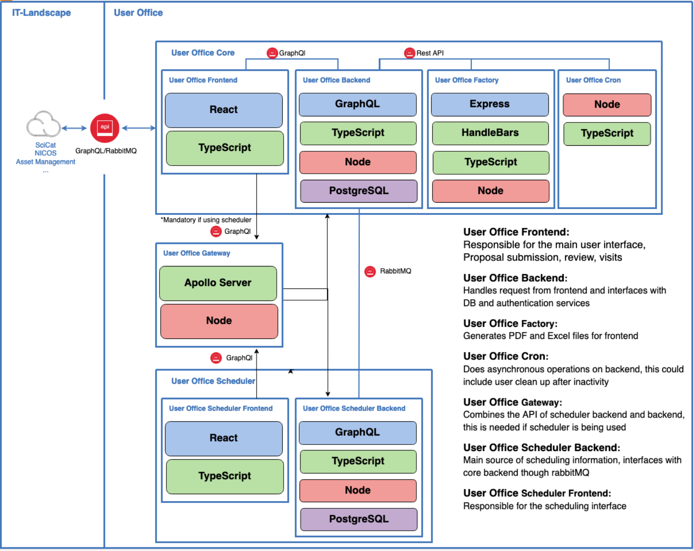

The following picture shows the components of the User Office architecture.

## Components

The User Office application is a comprehensive system designed to handle user interactions, proposal submissions, reviews, and scheduling. 
The architecture consists of several core components that interact through GraphQL and RabbitMQ for seamless communication and data flow.

At the heart of the system is the User Office Core, which includes the User Office Frontend, responsible for the main user interface, 
proposal submissions, reviews, and visits. The User Office Backend manages requests from the frontend, interfaces with the database, 
and handles authentication services. Additionally, the User Office Factory generates PDF and Excel files for the frontend, while the
User Office Cron performs asynchronous backend tasks such as user cleanup after inactivity.

The User Office Gateway combines APIs from the scheduler backend and core backend, providing a unified GraphQL API essential for systems
using the scheduler. The User Office Scheduler consists of two parts: the User Office Scheduler Frontend, which manages the scheduling 
interface, and the User Office Scheduler Backend, which serves as the main source of scheduling information and interfaces with the core
backend via RabbitMQ.

External dependencies such as SciCat, NICOS, and Asset Management systems interface with the User Office application, ensuring efficient
asset management and other related tasks. The entire system architecture is designed for robust and scalable performance, facilitating
efficient user management, data handling, and background processing operations.