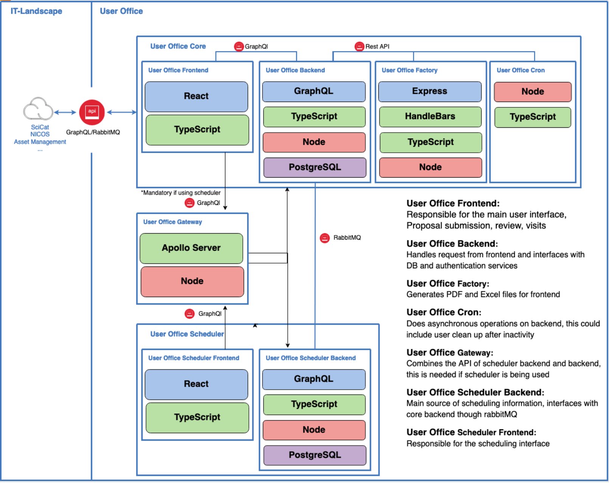

# Architecture

_________________________________________________________________________________________________________

The following picture shows the components of the User Office architecture.

_________________________________________________________________________________________________________

## Components

The User Office application leverages a modular architecture with several interconnected components that interact through GraphQL and RabbitMQ.

**User Office Core**

- Frontend: Manages the main user interface for proposal submissions, reviews, and visits.
- Backend: Handles requests from the frontend, interfaces with the database, and manages authentication services.

**User Office Factory**

- Generates PDF and Excel files for the frontend, supporting data export and reporting functionalities.

**User Office Cron**

- Performs asynchronous backend tasks, such as user cleanup after periods of inactivity, ensuring smooth system operations.

### Integration and Communication

**User Office Gateway**

- Combines APIs from the scheduler backend and core backend, providing a unified GraphQL API crucial for systems utilizing the scheduler.

**User Office Scheduler**

- Frontend: Manages the scheduling interface for users.
- Backend: Serves as the primary source of scheduling information and communicates with the core backend via RabbitMQ for real-time data exchange.

### External Dependencies

**SciCat, NICOS, and Asset Management Systems** 

- These external systems interface with the User Office application to ensure efficient asset management and integration with external resources, enhancing the overall functionality and data management capabilities.

_________________________________________________________________________________________________________
