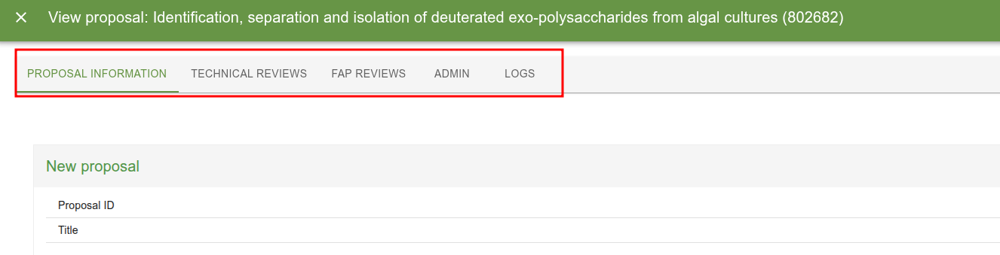

# Roles

_________________________________________________________________________________________________________

User Office controls what a user can see and do through **roles**. A user can hold several roles, but acts under one **current role** at a time.

There are two kinds of role:

- **Root roles** — the fixed, built-in roles that ship with the system.
- **Derived roles** — roles a User Officer creates at runtime by taking a root role as a base and attaching extra configuration and tags.

_________________________________________________________________________________________________________

# Root roles

A **root role** is one of the roles hard-coded in the `Roles` enum ([`apps/backend/src/models/Role.ts`](https://github.com/UserOfficeProject/user-office-core/blob/develop/apps/backend/src/models/Role.ts)). In the database their row has `is_root_role = true`.

Think of a root role as a **permission archetype**. Its behaviour is baked into the code: the authorization layer has explicit logic for each root role, and that logic does not change. Root roles are not tag-filtered — a root role sees everything its archetype is allowed to see.

The current root roles are:

| Role | Short code | In plain terms |
| --- | --- | --- |
| User | `user` | A visiting scientist who submits and manages their own proposals. |
| User Officer | `user_officer` | Administrator of the user program. Sees and manages everything. |
| FAP Chair | `fap_chair` | Leads the review panel for proposals assigned to their FAP. |
| FAP Secretary | `fap_secretary` | Administrative support for a FAP's review process. |
| FAP Reviewer | `fap_reviewer` | Reviews the proposals assigned to them within a FAP. |
| Instrument Scientist | `instrument_scientist` | Responsible for instruments; sees proposals tied to their instruments/techniques. |
| Experiment Safety Reviewer | `experiment_safety_reviewer` | Reviews the safety of proposed experiments. |
| Internal Reviewer | `internal_reviewer` | Reviews technical/internal aspects of assigned proposals. |
| Proposal Reader | `proposal_reader` | Role that is intended for set of users who need same level of read access as user officer but without possibility to alter the data |


_________________________________________________________________________________________________________

# Derived roles

A **derived role** (also called a *dynamic role* in some older code) is a role a User Officer creates through the UI. In the database its row has `is_root_role = false`.

A derived role is built from three parts:

1. **A base root role** — stored in the `short_code` column. The derived role inherits the permission archetype of that root role.
2. **Config** — a JSON blob (`config` column) that fine-tunes what the role can access. The shape of the config depends on the base root role.
3. **Tags** — a set of tags attached through the `roles_has_tags` join table. Tags *scope* what the role can see.

So where a root role says *"this is a Proposal Reader, and Proposal Readers behave like X"*, a derived role says *"this is a Proposal Reader **restricted to these tags** and **with these access flags turned on**"*.

## What tags mean

Tags are the heart of derived-role access control. For a `PROPOSAL_READER`-based role the rule is:

- **No tags attached → access to everything.** An empty tag set is treated as "unrestricted".
- **One or more tags attached → access is narrowed.** The role can only read proposals whose **call** or **instrument** is associated with one of those tags.

This logic lives in `ProposalAuthorization.hasReadRights` ([`apps/backend/src/auth/ProposalAuthorization.ts`](https://github.com/UserOfficeProject/user-office-core/blob/develop/apps/backend/src/auth/ProposalAuthorization.ts)):

```ts
case Roles.PROPOSAL_READER:
  const userTags = (
    await this.roleDataSource.getTagsByRoleId(agent!.currentRole!.id)
  ).map((tag) => tag.id);

  if (userTags.length === 0) {
    hasAccess = true; // no tags => see everything
    break;
  }

  // otherwise: access is limited to proposals whose call or
  // instrument is linked to one of the role's tags
  const userInstruments = ...;
  const userCalls = ...;
  hasAccess =
    (proposal.callId && userCalls.includes(proposal.callId)) ||
    proposalInstruments.some((i) => userInstruments.includes(i.id));
  break;
```

## The Proposal Reader config flags

A `PROPOSAL_READER` derived role carries four boolean flags (`ProposalReaderRoleConfig` in `Role.ts`). Each one unlocks a slice of the system on top of the basic proposal-read access:

| Flag | What it grants |
| --- | --- |
| `hasLogAccess` | Visibility of proposal/event logs. |
| `hasTechnicalReviewAccess` | Permission to read technical (feasibility) reviews. |
| `hasFapAccess` | Permission to read FAP reviews. |
| `hasAdminAccess` | Administrative privileges within the role's scope. |

These are checked in the relevant authorization classes — e.g. `TechnicalReviewAuthorization` gates on `hasTechnicalReviewAccess`, and `ReviewAuthorization` gates on `hasFapAccess`.



The default config applied when none is supplied is defined in `defaultConfig` in [`apps/backend/src/datasources/postgres/RoleDataSource.ts`](https://github.com/UserOfficeProject/user-office-core/blob/develop/apps/backend/src/datasources/postgres/RoleDataSource.ts).

_________________________________________________________________________________________________________

# How derived roles are stored

Everything lives in the `roles` table plus one join table:

| Column / table | Purpose |
| --- | --- |
| `roles.short_code` | The base root role this role derives from (e.g. `proposal_reader`). |
| `roles.config` | JSON config, shape depends on `short_code`. |
| `roles.is_root_role` | `false` for derived roles, `true` for built-in root roles. |
| `roles_has_tags` | Many-to-many link between a role and its scoping tags. |
| `role_user` | Links users to the roles they hold. |

Creating, updating and deleting derived roles, and assigning their tags, all require the `USER_OFFICER` role. See `RoleMutations` and `RoleTagsMutation`.

_________________________________________________________________________________________________________

# `injectDynamicRoleArgs` — how tag-scoping is enforced

You won't usually call tag logic by hand. The `@Authorized` decorator ([`apps/backend/src/decorators/Authorized.ts`](https://github.com/UserOfficeProject/user-office-core/blob/develop/apps/backend/src/decorators/Authorized.ts)) does it for you when the current role is a derived (non-root) role.

The @Authorized decorator takes the allowed root roles as arguments, controlling which roles may call the query/mutation. For derived roles it additionally populates any parameter marked with @AgentTags with the current role's tags.

The mechanism:

1. **Mark which arguments should receive tags.** On a query/mutation method, decorate the tag parameter with `@AgentTags`. This records the argument's position in metadata.

2. **At call time, `@Authorized` checks the current role.** If `agent.currentRole.isRootRole === false` and the method has `@AgentTags`-marked arguments, it calls `injectDynamicRoleArgs`:

    ```ts
    const injectDynamicRoleArgs = async (agent, args, indices) => {
      const tags = await roleDataSource.getTagsByRoleId(agent.currentRole!.id);
      const tagIds = tags.map((tag) => tag.id);
      indices.tags.forEach((index) => {
        args[index] = tagIds; // overwrite the marked argument with the role's tag ids
      });
    };
    ```

3. **The resolver receives the role's tags automatically.** The derived-role user never passes a tag filter themselves — the system silently overwrites the marked argument with the role's tags, so the underlying query is scoped to exactly what the role is allowed to see.

For **root roles** (`isRootRole === true`) this injection is skipped entirely — root roles are never tag-scoped.

!!! tip "Mental model"

    `@AgentTags` says *"this argument is a tag filter"*. `injectDynamicRoleArgs` says *"if you're a derived role, you don't get to choose the filter — I'll set it to your role's tags."*

## Caveats: choosing where to apply tag authorization

How you enforce tag access depends on whether your query returns a single entity or a collection.

**Single entity** — fetch the entity first, then check access with the authorizer after the query. If the user is not allowed to see it, return `null`. This post-fetch check is simple and sufficient because there is only one result to vet.

**Array of entities** — push the tags down into the data source layer and filter out inaccessible entities *as part of the database query*, rather than after it. This matters for **pagination**: a paginated query must return a fixed-size page, so filtering after the fact would leave short or inconsistent pages. Filtering in the query keeps page sizes correct and avoids leaking the existence of entities the user cannot access.


_________________________________________________________________________________________________________

# Extending the system

## Adding a new config flag to a derived role

1. Add the field to the relevant config type in [`apps/backend/src/models/Role.ts`](https://github.com/UserOfficeProject/user-office-core/blob/develop/apps/backend/src/models/Role.ts) (e.g. `ProposalReaderRoleConfig`).
2. Add the matching GraphQL input field in `RoleConfigInput.ts` (e.g. `ProposalReaderRoleConfigInput`).
3. Update `defaultConfig` / `resolveConfig` in `RoleDataSource.ts`.
4. Enforce the new flag in the appropriate authorization class.

## Introducing a new root role to derive from

1. Add the new short code to the `Roles` enum (or use existing one if you are simply adding support for the existing role) and a corresponding config type in `Role.ts`, then extend `createRole`'s switch.
2. Add a config input type and wire it into `RoleConfigInput`.
3. Handle the new short code in `defaultConfig` / `resolveConfig`.
4. Add a `case` for the role in the authorization classes that need it (e.g. `ProposalAuthorization.hasReadRights`).
5. If the role should be tag-scoped, make sure the relevant resolvers mark their tag argument with `@AgentTags`.

_________________________________________________________________________________________________________
