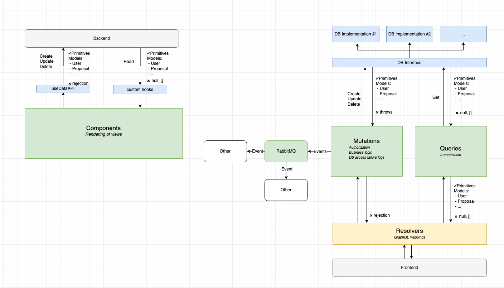

# Step-by-Step Guide

_________________________________________________________________________________________________________

Use this page to understand how different parts of the User Office code base is interconnected.

As an example, we will implement an imaginary feature that enables product owners to give user officers the ability to **lock out a user**.

## Backend

### Database changes

Start by adding a new column `is_locked` to the database by creating a new file under `/db_patches/00XX_AlterUserAddIsLocked.sql` (note the naming convention). This patch will automatically be executed on container startup and modify the database.

    DO
    $$
    BEGIN
	    IF register_patch('AlterUserAddIsLocked.sql', 'your_username', 'Add is_locked to the users table', '2024-08-08') THEN
        BEGIN
            ALTER TABLE users ADD COLUMN is_locked BOOL DEFAULT FALSE; 
        END;
	    END IF;
    END;
    $$
    LANGUAGE plpgsql;
    
### Code changes

Now that we have DB column, let’s write a function in our datasource layer that will update the database.

#### 1. Create new database interface function

Add a new interface function under `/src/datasources/AdminDataSource.ts`. The Interface function will accept one parameter user_id, and return a value object of type BasicUserDetails containing the user who was locked out.

    lockUser(user_id: number): Promise<BasicUserDetails>;

#### 2. Implement the interface in PostgreSQL

Add the function to handle the database request in the file by implementing the interface in `/src/datasources/postgres/AdminDataSource.ts`.

    lockUser(user_id: number): Promise<BasicUserDetails[]> {
    return database // Database is imported on top of imports and references a ready-to-use instance of Knex.
      .update({
        is_locked: true
      })
      .from("users")
      .where("user_id", user_id)
      .returning("*")
      .then((updatedRows: Array<UserRecord>) => {
        if (updatedRows.length !== 1) {
          throw new Error(`Could not lock user:${user_id}`);
        }
        return createBasicUserObject(updatedRows[0]); // createBasicUserObject is a utility function to convert DB records into value objects used in UserOffice, if there is a new table you would need to also add a new utility function that performs the conversion.
      });
    }

> **_NOTE:_** Knex is a powerful library that simplifies writing SQL in JavaScript. For questions about syntax or functionality, visit their comprehensive documentation at http://knexjs.org/.

#### 3. Implement the interface in mockups

Also implement the interface in mockup db in `/src/datasources/mockups/AdminDataSource.ts`. Mockup DB layer is used in unit tests.

    async lockUser(
    user_id: number
    ): Promise<BasicUserDetails> {
    return new BasicUserDetails(user_id, 'Carl', 'Young', 'ESS', 'Pharmacist')
    }

#### 4. Add function to logic layer for handling requests

With the database layer now ready, it's time to implement a mutation. Mutations contains database error handling, authorization and other important business logic. Procees by navigating to `/src/mutations/AdminMutations.ts` and add a new function.

    async lockUser(
       agent: User | null, // This is a reference to the currently logged-in user, which will be passed in from resolver in next step.
       userId: number
     ): Promise<BasicUserDetails | Rejection> { // Rejection is part of UserOffice value objects, contains reason.
       if (!(await this.userAuth.isUserOfficer(agent))) { // We will only allow a user officer to call this method.
         return rejection("NOT_AUTHORIZED");
       }
        return this.dataSource
          .lockUser(userId) // Call to our newly implemented function in the database layer.
          .then(user => {
            return user;
          })
          .catch(error => {
            logger.logException("Could not lock user", error, {
              agent,
              userId
            }); // This part is crucial for debugging. Ensure the error message is descriptive, can be aggregated, and add specific details in the context.
            return rejection("INTERNAL_ERROR");
          });
    }

#### 5. Create a resolver that exposes mutation functionality to GraphQL

Create new file in `/src/resolvers/mutations/LockUserMutation.ts`. Note that Resolvers relies heavily on decorators (https://www.typescriptlang.org/docs/handbook/decorators.html)

    @Resolver() // Classify the class as resolver by using @Resolver decorator.
    export class LockUserMutation { // The naming convention is <functionName>Mutation.
      @Mutation(() => BasicUserDetailsResponseWrap) // Classify method as Mutation by using decoration @Mutation, and signifying response type. Response in this case is BasicUserDetailsResponseWrap which is commonly shared. If you introduce new ValueObject you want to also add new responseWrap. Please check /src/resolvers/wrappers/CommonWrappers.ts for more details.
 
      lockUser( // The name of the mutation that will show up in GraphQL API.
        @Arg("userId", () => Int) userId: number // Mutation argument. For mutations with more arguments you might choose to create separate Arguments class to group them.
        @Ctx() context: ResolverContext // Mark argument with @Ctx decorator and it will contain context populated by TypeGraphql framework. Context contains references to mutation as well as the user details object for the currently logged in user.
      ) {
        return wrapResponse( // wrapResponse will evaluate your mutation call and format response.
          context.mutations.admin.lockUser(context.user, userId), // TypeScript will check the compatibility of mutation response and wrapper compile time.
          BasicUserDetailsResponseWrap // ResponseWrapper to use.
        );
      }
    }

All response wrappers contain a response field and an error field. The error field is a string and always called `error`, while the name and type of the response field can vary. 

- If a mutation fails, response field will be `null` and error will be populated with `error`.
- If a mutation succeeds, response field will be the result but error will be `null`.

**And that's it!** Test if things are working properly by navigating to [http://localhost:4000/graphql](http://localhost:4000/graphql) where you should see a new endpoint mutation. You can check the backend output terminal for any potential errors.

_________________________________________________________________________________________________________

## Frontend

Now that we managed to get the backend working, calling it from the frontend is surprisingly easy.

#### 1. Write GraphQL mutation

Create a new file lockUserMutation and write the mutation:

    mutation lockUser($userId: Int!) { // name your query
      lockUser(userId: $userId) { // call graphql endpoint
        user {
          firstname
        }
        error
      }
    }

#### 2. Regnererate SDK

    npm run generate:local

This will regenerate sdk in the `src/generated/sdk.ts` file on client side which contains new signatures of the GraphQL layer, including our new `lockUser` method. This will also typecheck your mutation and make sure it is existing and valid.

#### 3. Call the method

Create a hook and invoke the method

    import { useDataApi } from "../hooks/useDataApi";
 
    ...
 
    const api = useDataApi();
 
    ...
 
    api().lockUser({userId:1})

_________________________________________________________________________________________________________
