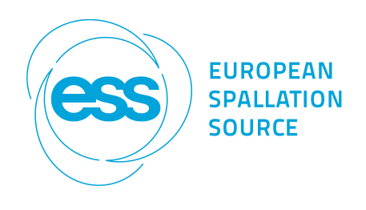

# HOME

_________________________________________________________________________________________________________

{ align=left, width="300" } 

## Welcome to User Office

The User Office project is an international collaboration to build flexible web software designed to efficiently run and organize user programs at various scientific facilities. 

We have built this software with flexibility in mind - allowing user officers and user program managers to configure the software to the specific needs of their facility.

_________________________________________________________________________________________________________

## Key Features

- **Proposal Submission:** Scientists can submit proposals based on questionnaires and calls defined by user officers.
- **Workflow Definition:** User officers can define workflows to describe different facility access routes.
- **Technical Reviews:** Facility science staff can submit technical reviews on each proposal.
- **Scheduler:** User officers can utilize the scheduler for efficient resource allocation, instrument management, and experiment scheduling.
- **Science Evaluation Panels:** Science evaluation panels can be set up to review proposals.

_________________________________________________________________________________________________________

## Used at

#### European Spallation Source

{ align=left, width="150" } 

The European Spallation Source (ESS) started building this software in 2018 with the vision that it would work for any facility. The ESS has been using the software to run their Deuteration and Macromolecular Crystallisation (DEMAX) facility since 2020.

#### Science and Technology Facilities Council

{ align=left, width="200" } 

The Science and Technology Facilities Council (STFC) joined the collaboration with the ESS in 2020. The software has been used to accept proposals for facilities at STFC since late 2021 and has been rolled out to the ISIS Neutron and Muon Source, and the Central Laser Facility.

#### Extreme Light Infrastructure

{ align=left, width="150" } 

The Extreme Light Infrastructure (ELI) is the world's largest and most advanced high-power laser infrastructure. They are a global technology and innovation leader in high-power, high-intensity, and short-pulsed laser systems. 

_________________________________________________________________________________________________________

## Quickstart
- [Get started here](quick_start.md)

_________________________________________________________________________________________________________
