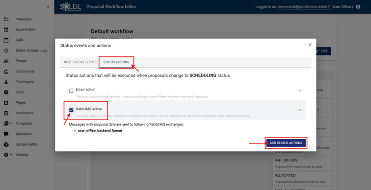
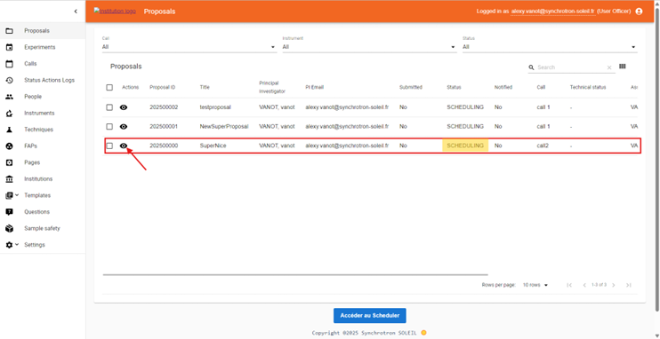
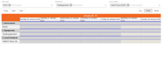

# Scheduler :material-calendar-month:

_________________________________________________________________________________________________________

## What is the Scheduler?

The Scheduler helps instrument scientists plan and manage experiment time on instruments and equipment.

With the calendar interface, they can:

- Create, view, organize, and adjust scheduled time slots (also called experiments)
- Filter by instrument, equipment, or local contact for efficient planning

This ensures clear visibility of upcoming work and streamlined allocation of beam time.

_________________________________________________________________________________________________________

## Accessing the Scheduler Interface

The scheduling service is not available by default within the core part of the User Office Application. Instead, scheduling is running as a separate microservice. Since it is a dedicated Application, the User Office Scheduler comes with its own URL, which is usually different from that of User Office Core. However, the exact URL depends on how the Infrastructure is set up.

_________________________________________________________________________________________________________

## Prerequisites

### System Requirements
- Docker-enabled environment

### Essential Configuration
- The scheduling service must be deployed and activated to allow access.
- Users must have appropriate permissions as Instrument Scientists or administrators (User Officer) to access and modify scheduling data.

### Scheduling Proposals
- This part should be done by the User Officer in the User Office Core application.
- Not all proposals show up in the Scheduler. It is only when Proposal enters particular state will it be eligible for scheduling. You can define the state as an ENV variable for the scheduler via **UPSERT_PROPOSAL_BOOKING_TRIGGER_STATUSES** parameter. 
Example:
```
UPSERT_PROPOSAL_BOOKING_TRIGGER_STATUSES="SCHEDULING, ALLOCATED"

```
In the example above, proposals in **SCHEDULING** status will appear in the calendar, and administrators can assign time slots (experiments) accordingly. Note there are 2 ways to set a proposal to **SCHEDULING** status:
  1. **Through Workflow**: Configure the workflow to automatically transition proposals to **SCHEDULING** status based on predefined criteria. For more details on configuring the **SCHEDULING** status, refer to the [Creating Workflow guide](../user-guide/user-officer/creating_workflow.md).
  2. **Manual Status Change**: The User Officer can manually change the status of a proposal to **SCHEDULING** within the User Office Core application.
- Proposals need to be **Accepted** by the User Officer in order to be scheduled.
- It is necessary to check the **RabbitMQ** box in the **SCHEDULING** status of the Call Workflow to allow the proposal to be processed in the scheduler. To enable this:
  1. Open your workflow.
    

  2. Click on the path that leads to **SCHEDULING** status workflow tree.

    

  3. Click on **Status Actions** and check the **RabbitMQ** box.

    


You can now put your proposal in **SCHEDULING** status and allocate time slots, so it will appear in the scheduler.




_________________________________________________________________________________________________________

## Interface

### Left Panel
The left panel displays the different menus available in the User Office Application. The default page is **Calendar**, where all planned time slots are visualized. Additional menus, such as **Equipment List** and **Equipment Request**, will be added to manage equipment and related requests.


### Calendar Page
The calendar interface is dedicated to **Instrument Scientists** and allows them to view planned time slots on a calendar.
**NOTE:** Instrument Scientist will be able to do the Scheduling operation only for the Instruments they are assigned to.


#### Calendar Features:
- **Default Display**: The calendar is displayed by default in **Calendar mode**, providing a classic view of the schedule over a given period.

#### Available Filters:
- **By instrument**: Filters time slots by specific instruments, such as beamlines like **ROCK**.
- **By equipment**: Filters by the equipment being used (details available in the Equipment List menu).
- **By local contact**: Displays time slots by associated Instrument Scientists.


#### Display Types:
The right panel allows changing the calendar display type with three options:
1. **Calendar**: Classic view (default).


2. **Table**: Structured tabular view of time slots.


3. **Timeline**: Chronological view similar to Outlook, providing a linear and intuitive representation of time slots.



_________________________________________________________________________________________________________

## Event Management

A **NEW EVENT** button is available to create new events, such as:
- **Maintenance**: Scheduling a time period for instrument or equipment maintenance.
- **Shutdown**: Scheduling machine downtime.


### Time Slots to Plan
Time slots link directly to proposals. When a proposal reaches the SCHEDULING status, it appears on the calendar and can be assigned time.

Example:

- Proposal 2025000 is in SCHEDULING
- Currently scheduled for 2 days and 17 hours

This section provides a clear overview of planning and managing beam time for instruments and equipment.


_________________________________________________________________________________________________________

