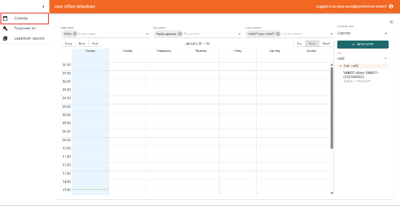
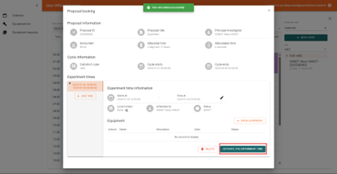

# Scheduler :material-calendar-month:

_________________________________________________________________________________________________________

## What is the Scheduler?

The Scheduler section of the DUO ESS application allows instrument scientists to plan and manage time slots for the use of equipment and instruments. This feature is accessible via the calendar interface, where users can view, organize, and modify beam time slots. The module also allows filtering of time slots based on various criteria for efficient scheduling.  

_________________________________________________________________________________________________________

## Accessing the Scheduler Interface

The scheduling module is not accessible by default within the core part of the DUO ESS application. Instead, scheduling is managed through a separate interface. Users must navigate to the dedicated scheduling URL:  
[test-sun-scheduler.example.com](test-sun-scheduler.example.com) (example link)  
The core application remains accessible at `test-sun-duo.example.com`, and scheduling must be accessed separately.

_________________________________________________________________________________________________________

## Prerequisites

### System Requirements
- A supported web browser (Chrome, Firefox, Safari, etc.).

### Essential Configuration
- The scheduling module must be deployed and activated to allow access.
- Users must have appropriate permissions as Instrument Scientists or administrators (useroffice) to access and modify scheduling data.

### Linking Proposals
- Scheduling is tied to Calls for each proposal which must be correctly associated with planned time slots.
- Proposals in **SCHEDULING** status will appear in the calendar, and administrators can assign time slots accordingly.
- It is necessary to check the **RabbitMQ** box in the **SCHEDULING** status of the Call Workflow to allow the proposal to be processed in the scheduler. To enable this:
  1. Click on the **SCHEDULING** status in your workflow tree.

    

  2. Click on **Status Actions**.

    

  3. Check the **RabbitMQ** box.

    

You can now put your proposal in **SCHEDULING** status and allocate time slots, so it will appear in the scheduler.

_________________________________________________________________________________________________________

## Interface

### Left Panel
The left panel displays the different menus available in the DUO ESS application. The default page is **Calendar**, where all planned time slots are visualized. Additional menus, such as **Equipment List** and **Equipment Request**, will be added to manage equipment and related requests.

### Calendar Page
The calendar interface is dedicated to **Instrument Scientists** and allows them to view planned time slots on a calendar. Scheduling is done with a minimum granularity of **1 hour**, unlike shifts (**8-hour time slots**) used for other types of scheduling.

#### Calendar Features:
- **Default Display**: The calendar is displayed by default in **Calendar mode**, providing a classic view of the schedule over a given period.

#### Available Filters:
- **By instrument**: Filters time slots by specific instruments, such as beamlines like **ROCK**.
- **By equipment**: Filters by the equipment being used (details available in the Equipment List menu).
- **By local contact**: Displays time slots by associated Instrument Scientists.

#### Display Types:
The right panel allows changing the calendar display type with three options:
1. **Calendar**: Classic view (default).

2. **Table**: Structured tabular view of time slots.

3. **Timeline**: Chronological view similar to Outlook, providing a linear and intuitive representation of time slots.

_________________________________________________________________________________________________________

## Event Management

A **NEW EVENT** button is available to create new events, such as:
- **Maintenance**: Scheduling a time period for instrument or equipment maintenance.
- **Machine downtime**: Scheduling machine downtime.
- **Events independent of proposals**: Creating events that are not linked to a proposal.

### Time Slots to Plan
Time slots are associated with proposals. For example, a proposal in **SCHEDULING** status may appear in the calendar, as shown with proposal **2025000**. This proposal is currently being scheduled for a duration of **2 days and 17 hours**. This process is essential for managing periods of instrument and equipment usage.

_________________________________________________________________________________________________________

## Key Features Summary:

- Clear visualization of time slots through an interactive calendar.
- Dynamic filters to sort by instrument, equipment, or local contact.
- Flexible display with three different modes (**Calendar, Table, Timeline**).
- Scheduling of specific events such as maintenance or machine downtime.
- Management of proposals in **SCHEDULING** status for time slot assignment.

This interface allows **Instrument Scientists** and **administrators** to efficiently manage the use of instruments and equipment while providing an adaptable calendar view to meet each user's specific needs.

_________________________________________________________________________________________________________
