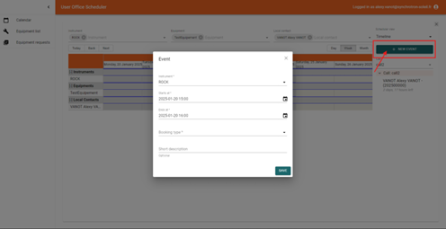

# Scheduler :material-calendar-month:

---

## What is the Scheduler?

The Scheduler helps Instrument Scientists plan and manage experiment time on instruments and equipment.

With the calendar interface, they can:

- Create, view, organize, and adjust scheduled time slots (also called experiments)
- Filter by instrument, equipment, or local contact for efficient planning

This ensures clear visibility of upcoming work and streamlined allocation of beam time.

---

## Accessing the Scheduler Interface

The scheduling service is not available by default within the core User Office Application. Instead, it runs as a separate microservice. As a dedicated application, the User Office Scheduler has its own URL, typically different from the User Office Core URL. The exact URL depends on the infrastructure setup.

---

## Prerequisites

### System Requirements

- Docker-enabled environment

### Essential Configuration

- The scheduling service must be deployed and activated to allow access.
- Users must have appropriate permissions as Instrument Scientists or administrators (User Officer) to access and modify scheduling data.

### Scheduling Proposals

- Not all proposals show up in the Scheduler. A proposal becomes eligible for scheduling only when it enters a specific status (done via User Office Core). You can define this status using the **UPSERT_PROPOSAL_BOOKING_TRIGGER_STATUSES** environment variable for the scheduler service (e.g. SCHEDULING)
  Example:

```
UPSERT_PROPOSAL_BOOKING_TRIGGER_STATUSES="SCHEDULING"

```

Hint: Use comma to add more than one status

```
UPSERT_PROPOSAL_BOOKING_TRIGGER_STATUSES="SCHEDULING, ALLOCATED"

```

In the example above, proposals in **SCHEDULING** status will appear in the planning sidebar, and administrators can assign time slots (experiments) accordingly. There are two ways to set a proposal to the **SCHEDULING** status:

1. **Through Workflow**: Configure the workflow to automatically transition proposals to **SCHEDULING** status based on predefined criteria. For more details on configuring the **SCHEDULING** status, refer to the [Creating Workflow guide](../user-guide/user-officer/creating_workflow.md).
2. **Manual Status Change**: The User Officer can manually change the status of a proposal to **SCHEDULING** within the User Office Core application.

- Proposals need to be **Accepted** by the User Officer in order to be scheduled.
- It is necessary to check the **RabbitMQ** box in the **SCHEDULING** status of the Call Workflow to allow the proposal to be processed in the scheduler. To enable this:

  1. Open your workflow.
     

  2. Click on the path that leads to **SCHEDULING** status workflow tree.

  

  3. Click on **Status Actions** and check the **RabbitMQ** box.

  

Ensure the proposal is **Accepted** and its status matches the configured trigger status (e.g. **SCHEDULING**). Once these two conditions are met, you can allocate time slots, and they will appear in the scheduler.


---

## Interface

### Left Panel

The left panel displays the menus available in the Scheduler interface. The default page is **Calendar**, where all planned time slots are visualized. Additional menus, such as **Equipment List** and **Equipment Request**, will be added to manage equipment and related requests.


### Calendar Page

The calendar interface is designed for **Instrument Scientists**, allowing them to view planned time slots.
**NOTE:** Instrument Scientists can only schedule operations for the instruments they are assigned to.


#### Calendar Features:

- **Default Display**: The calendar defaults to **Calendar mode**, providing a classic view of the schedule.

#### Available Filters:

- **By instrument**: Filters time slots by specific instruments (e.g., beamlines like **ROCK**).
- **By equipment**: Filters by the equipment in use (details available in the Equipment List menu).
- **By local contact**: Displays time slots by the associated Instrument Scientist.


#### Display Types:

The right panel allows you to change the calendar display type using three options:

1. **Calendar**: Classic view (default).


2. **Table**: Structured tabular view of time slots.


3. **Timeline**: Chronological view similar to Outlook, providing a linear and intuitive representation of time slots.


---

## Event Management

A **NEW EVENT** button is available to create new events, such as:

- **Maintenance**: Scheduling a time period for instrument or equipment maintenance.
- **Shutdown**: Scheduling machine downtime.




### Time Slots to Plan

Time slots are directly linked to proposals. When a proposal reaches the **SCHEDULING** status (or other configured status), it appears in the planning sidebar and can be assigned time.

Example:

- Proposal 2025000 is in SCHEDULING
- Currently scheduled for 2 days and 17 hours

This section provides a clear overview of planning and managing beam time for instruments and equipment.


---
