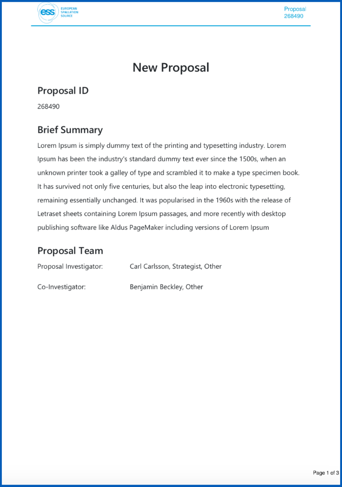
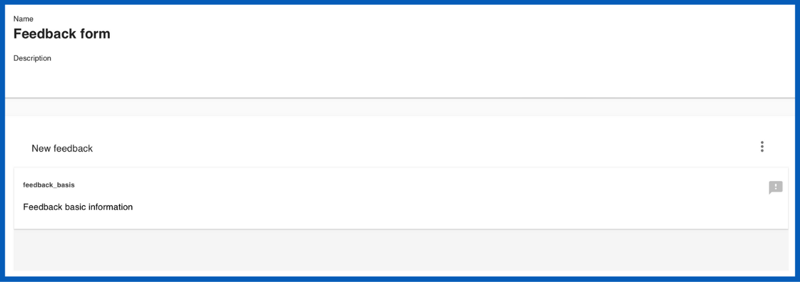
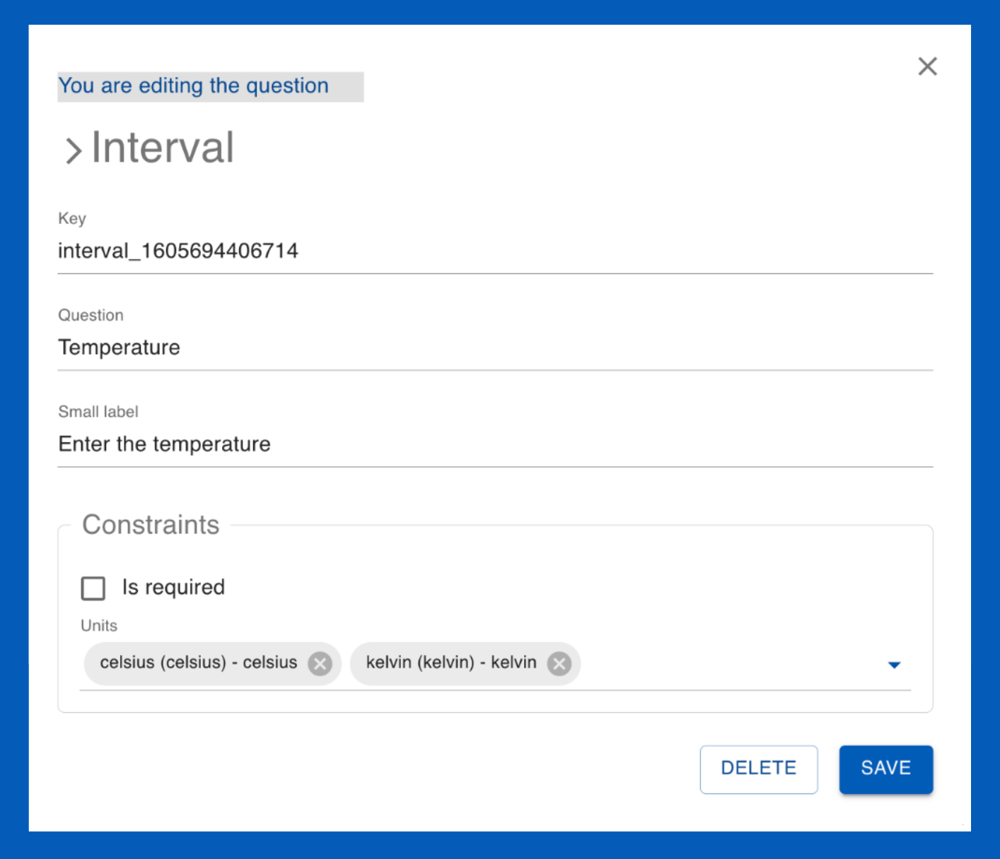
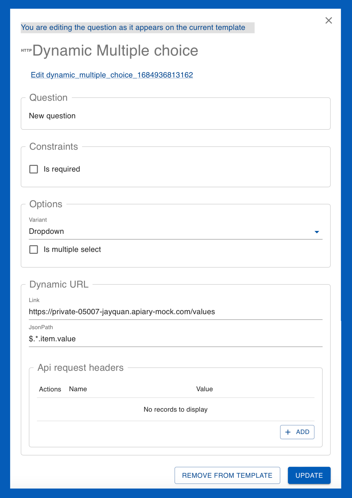
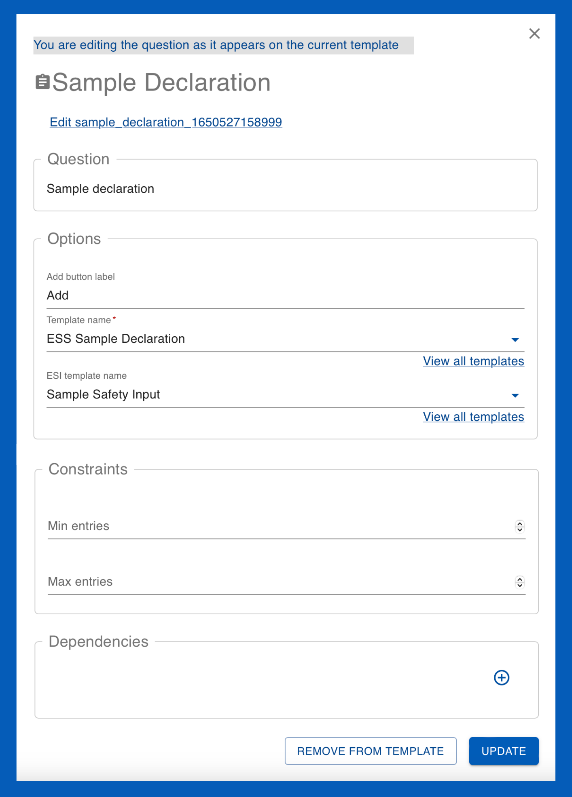

# Creating templates :material-text-box-multiple:

_________________________________________________________________________________________________________

## What are templates?

Templates :material-text-box-multiple: are used to save and re-utilise predefined information across User Office. Calls are built using several different types of templates which can be edited and cloned. Templates carry information and serve many functions; for example, they may contain specific questions to be used within the call which users answer in their proposals. The template system is useful because it saves you having to do all the work from scratch every time. Furthermore, it allows for standardisation which is essential for data collection and analysis.

There are several different types of templates utilised within Calls:

### Types of templates

??? info "PDF templates :material-file-pdf-box:" 
    [PDF templates :material-file-pdf-box:](templates/pdf_template.md) enable users and User Officers to download proposals in a well-formatted and standardised PDF document for summary and sharing. User Officers can customise PDF templates by adjusting code to modify elements such as font size, colour and other formatting options.

    ______________________________________________________________________________________

    <figure markdown="span">  
        { width="450"}
        <figcaption>PDF template</figcaption>
    </figure>

??? info "Proposal templates :material-note-text:" 
    [Proposal templates :material-note-text:](templates/proposal_template.md) are designed to capture all necessary information that users need to provide when submitting their proposals. These templates generally include questions regarding experiment details, objectives, safety considerations and required resources. Users fill in their answers to these questions in the predefined fields and submit their proposals for review.

    User Officers can also utilise [questions :material-comment-question:](questions.md) and [sub-templates :material-collapse-all-outline:](templates/sub_template.md) to customise proposal templates to include specific questions based on the nature and requirements of the research.
    ______________________________________________________________________________________
    <figure markdown="span">  
        { width="450"}
        <figcaption>Proposal (viewed from the user's perspective)</figcaption>
    </figure>

??? info "Sample declaration templates :material-inbox:" 
    [Sample declaration templates :material-inbox:](templates/sampledec_template.md) are designed to collect detailed information about the samples that researchers intend to use in their experiments. The purpose of these templates is to standardise the way sample-related data is gathered, ensuring that all necessary details are captured uniformly across different proposals. These templates are linked to [proposal templates :material-note-text:](templates/proposal_template.md) through sample declaration [questions :material-comment-question:](questions.md).

    ______________________________________________________________________________________
    <figure markdown="span">  
        { width="450"}
        <figcaption>Sample declaration question linking to a Sample Delaration Template and Sample Experiment Safety Input (ESI) template</figcaption>
    </figure>

??? info "Sub templates :material-collapse-all-outline:" 
    [Sub templates :material-collapse-all-outline:](templates/sub_template.md) are used to streamline and organise the creation of complex [proposal templates.](templates/proposal_template.md). They serve as reusable building blocks containing [questions](questions.md), enabling User Officers to efficiently manage and deploy recurring sets of questions across multiple proposals.

    Sub templates are created by grouping related question templates into a cohesive unit and saving them as a standalone entity. When constructing or modifying a proposal template, User Officers can easily select and insert these sub templates into the appropriate sections, ensuring consistency and reducing the time required to build detailed proposal forms.
    ______________________________________________________________________________________
    <figure markdown="span">  
        { width="450"}
        <figcaption>Sub template</figcaption>
    </figure>

??? info "Shipment declaration templates :material-truck:" 
    [Shipment declaration templates :material-truck:](templates/shipment_template.md) are standardised forms used to collect and organise information about parcels being sent to a facility. These templates can be customised to guide users through the process of declaring each shipment, generating labels for package identification, and ensuring compliance with shipping protocols. Each parcel's details, including tracking information and handling instructions, are documented to facilitate smooth and traceable delivery to the facility.

    > **_NOTE:_** The shipment declaration form will only become accessible for users to fill out after their proposal status had been set to 'accepted' and the experiment has been allocated a time within the scheduler.
    ______________________________________________________________________________________
    <figure markdown="span">  
        { width="450"}
        <figcaption>Shipment declaration (viewed from the user's perspective)</figcaption>
    </figure>

??? info "Visit registration templates :material-airplane-takeoff:" 
    [Visit registration templates :material-airplane-takeoff:](templates/visit_template.md) are predefined forms used to gather and organise information from visitors planning to access a research facility. These templates collect essential details regarding visitor accomodation needs, arrival and departure dates, and on-site access, ensuring that the visit is properly coordinated and compliant with facility protocols.

    > **_NOTE:_** The visit registration form will only become accessible for users to fill out after their proposal status had been set to 'accepted' and the experiment has been allocated a time within the scheduler.
    ______________________________________________________________________________________
    
    <figure markdown="span">  
        { width="450"}
        <figcaption>Visit reigstration (viewed from the user's perspective)</figcaption>
    </figure>

??? info "Proposal ESI templates :material-note-text:" 
    [Proposal Experiment Safety Input (ESI) :material-note-text:](templates/proposalESI_template.md) are designed to collect and document safety-related information for research proposals, ensuring that all necessary safety considerations are addressed before the experiment begins. User Officers can use ESI templates to gather details about potential hazards, risk assessments, safety measures, and compliance with regulatory standards. This structured approach helps in maintaining a safe research environment and ensures that all safety protocols are thoroughly evaluated and documented. User Officers can also utilise [questions](questions.md) and [sub-templates](templates/sub_template.md) to customise Proposal ESI templates. This form is available after the users experiment has been accepted and scheduled so that users may review and confirm the safety information in case of any changes made to the experiment.

    > **_NOTE:_**The Proposal ESI form will only become accessible for users to fill out after their proposal status had been set to 'accepted' and the experiment has been allocated a time within the scheduler.
    ______________________________________________________________________________________
    
    <figure markdown="span">  
        { width="450"}
        <figcaption>Proposal ESI (viewed from the user's perspective)</figcaption>
    </figure>

??? info "Sample ESI templates :material-inbox:" 
    [Sample Experiment Safety Input (ESI) templates :material-inbox:](templates/sampleESI_template.md) are predefined forms used to collect safety-related information about the samples involved in an experiment. These templates are added to [proposal templates](templates/proposal_template.md) through [sample declaration question templates](questions.md), ensuring that all safety considerations, such as potential hazards or special handling requirements, are thoroughly documented and assessed as part of the proposal submission process. 
    ______________________________________________________________________________________
    
    <figure markdown="span">  
        { width="450"}
        <figcaption>Sample ESI template</figcaption>
    </figure>

??? info "Feedback templates :material-message-alert:" 
    [Feedback templates :material-message-alert:](templates/feedback_template.md) are structured questionnaires used to collect feedback from users about their experiments and overall experience at the facility. These templates allow users to provide insights and evaluations, which help the facility improve its services and address any issues.

    > **_NOTE:_** The feedback form will only become accessible for users to fill out after their proposal status had been set to 'accepted' and the experiment has been allocated a time within the scheduler.
    ______________________________________________________________________________________
    
    <figure markdown="span">  
        { width="450"}
        <figcaption>Feedback form (viewed from the user's perspective)</figcaption>
    </figure>

The template creation process is similar for all types of templates except for [PDF templates :material-file-pdf-box:](templates/pdf_template.md) which are built with customizable code. All other templates are built with [questions. :material-comment-question:](questions.md) 

_________________________________________________________________________________________________________

## Step 1: Adding topics

* In the **main menu** :material-menu: select **Templates** :material-text-box-multiple:
* From the dropdown menu, choose the type of template you wish to create
* From the template page, use the `Create` button. 
* Enter a name and optional description for your new template. 

* This will bring you to the template editor. From here you may add topics which act as the different sections within the questionnaire that users fill out. 

It is good practice to utilise topics to split up the presentation of information for users. For example, in a proposal template you may wish to have a topic for addressing general information, another for support requirements and another for experiment details, etc.
    
* You can add questions to topics by clicking on **options** and from the dropdown select ^^`Add topic`^^. Topics can be reordered by clicking on the ^^`Reorder topics mode`^^ option. In reorder topics mode, you may **drag and drop** the topics into the desired order.

## Step 2: Adding questions

* To add  [questions :material-comment-question:](questions.md) click on **options** and from the dropdown select ^^`Add question`^^. 
* This will open the **question drawer** which contains all previously used questions. You can ^^`Search`^^:material-magnify: for pre-existing questions through **question text** or by **question type**. You may preview questions in the question drawer by clicking on them. 

 > **_NOTE:_** Not all question types are compatible with every template. For example, **sub-template** questions can only be added to **proposal templates**.

### Options when adding questions to a template

**1. Use a pre-existing question**

* To add a pre-exisiting question to the template simply find it in the question drawer and **drag and drop** it into the template. 

**2. Edit a pre-existing question** 

* First add a pre-exisiting question to the template. You can them modify it by clicking on it within the template.

> **_NOTE:_** The changes you make to questions will only be updated within the current template you are creating. If you wish to make changes to the question **across all templates** click on the `edit` (question key) link at the top of the question. 

Once you are satisfied with your changes, click the `Update` button to save the changes to the question within the current template.

**3. Creating a question**

You may also create questions from scratch by clicking on **options** within the **question drawer** and selecting the question type you wish to create. The following is information for creating each of the question types:

??? info "Boolean :material-square-outline:"
    { align=left width="350"}

    **Boolean:** A checkbox question type which can have one of the two possible values; true or false ('Yes' or 'No')

    * **Key:** The question key

    * **Question:** Fill in your question (It should be clear a 'yes' or 'no' answer applicable to the checkbox)

    **Contraints:**

    * **User must check it to continue:** enabling this constraint means that the user must check the box in order to continue filling out (and submit) their proposal. This is useful to use in questions that must be agreed to such as 'I acknowledge this is an Expression of Interest' or 'I agree to the terms and conditions'.

??? info "Date :material-calendar-today:"
    { align=left width="350"}

    **Date:** Allows users to specify a date which can be selected from a calendar tool 

    * **Key:** The question key

    * **Question:** Fill in your question (it should relate to a date; e.g., please specify a delivery date) 

    * **Include time:** This refers to including a specific time (in hours, minutes) for the date

    * **Tooltip:** This is text that appears to help the user. In this case it appears below the field where users specify the date.

    **Constraints:**

    * **Is required:** enabling this constraint means that the user must select a date range in order to continue filling out (and submit) their proposal.

    * **Min/Max:** This allows you to define a valid date range. Min refers to the earliest date and max refers to the latest date which can be chosen. *Note: leaving these field empty allows the user to chose any date*
    
    * **Default:** Default is the date the calendar will be set to by default when the user goes to select the date. 

    **Dependencies:** 
    
    * This allows you to add depencies to configure the conditions which need to be met for this question is displayed to users. Leaving the dependencies empty will display the question to users irrespective of their responses.

??? info "Embellishment :material-format-size:"
    { align=left width="350"}
    
    **Embellishment:** A the text file which can be customised to modify elements such as font size, colour and formatting options facilitating the display of more detailed information for users. Note: this is not a question that users can provide responses to.

    * **Key:** The question key

    * **Plain description:** A plain description of the information being requested to be used for reference

    * **Omit from PDF:** Selecting this option will omit this section from the downloadable proposal pdf 

    **Dependencies:** 
    
    * This allows you to add depencies to configure the conditions which need to be met for this question is displayed to users. Leaving the dependencies empty will display the question to users irrespective of their responses.

??? info "File Upload :material-paperclip:"
    { align=left width="350"}

    **File Upload** A question which allows users to upload attachments 

    * **Key:** The question key

    * **Question:** Fill in your question (it should relate to attachmets; e.g., please upload figures for reference) 

    **Options** 

    * **Helper text:** Allows you to add more information for users which may be helpful with regard to the file upload (e.g., only PDF accepted)

    **Constraints:**

    * **Is required** enabling this constraint means that the user must upload files to continue filling out (and submit) their proposal.
    
    * **Omit from PDF:** Selecting this option will omit this section from the downloadable proposal pdf 

    * **Accepted file types** Select the accepted file types for users to upload

    * **Max number of files** Select the maximum number of files permitted for users to upload

    **Dependencies:** 
    
    * This allows you to add depencies to configure the conditions which need to be met for this question is displayed to users. Leaving the dependencies empty will display the question to users irrespective of their responses.

??? info "Sub Template :material-list-box-outline:"
    { align=left width="350"}

    **Sub Template** Sub templates are allow for related questions to be grouped into a cohesive unit and saved them as a standalone entity. 

    * **Key:** The question key

    * **Question:** Add a question or title text

    **Options:**

    * **Template name:**

    * **Add button label:** Customise the text on the add button

    * **Can copy:** 

    **Constraints:**

    * **Min/max entries**

    **Dependencies:**
    
    * This allows you to add depencies to configure the conditions which need to be met for this question is displayed to users. Leaving the dependencies empty will display the question to users irrespective of their responses.

??? info "Interval :material-chevron-right:"
    { align=left width="350"}

    **Interval**

    * **Key:** The question key

    * **Question:** Fill in a question or title text (e.g., temperature)

    * **Small label:** Add a small subheading under the question text (e.g., enter the temperature)

    **Constraints:** 

    * **Is required:** enabling this constraint means that the user must provide an interval in order to continue filling out (and submit) their proposal.

    * **Units:** specifies the interval units

    **Dependencies:** 
    
    * This allows you to add depencies to configure the conditions which need to be met for this question is displayed to users. Leaving the dependencies empty will display the question to users irrespective of their responses.

??? info "Multiple choice :material-record-circle:"
    { align=left width="350"}

    **Multiple choice** a multiple choice selection question.

    * **Key:** The question key

    * **Question:** Fill in your question (e.g., which is the main sub discipline of engineering?)

    **Constraints** 

    * **Is required:** enabling this constraint means that the user must select an option in order to continue filling out (and submit) their proposal.

    **Options**

    * **Variant:** allows you to specify the multiple choice format. The **radio** option provides the choices in a list in which only one can be chosen. The **dropdown** option provides a dropdown menu of the choices where multiple options can be chosen if the **is multiple select** box is enabled.

    **Items**

    * This section allows you to customise the answer choices. The order can be changed with the Up and Down arrows.

    **Dependencies:** 
    
    * This allows you to add depencies to configure the conditions which need to be met for this question is displayed to users. Leaving the dependencies empty will display the question to users irrespective of their responses.

??? info "Dynamic multiple choice :material-web:"
    { align=left width="350"}

    **Dynamic Multiple Choice:** 

    * **Key:** The question key

    * **Question:** Fill in your question

    **Constraints:**

    * **Is required:** enabling this constraint means that the user must select an option in order to continue filling out (and submit) their proposal.

    **Options**

    * **Variant:** allows you to specify the multiple choice format. The **radio** option provides the choices in a list in which only one can be chosen. The **dropdown** option provides a dropdown menu of the choices where multiple options can be chosen if the **is multiple select** box is enabled.

    **Dynamic URL**

    * **Link:** Provide the URL

    * **JsonPath:** Provide the JsonPath

    **API request headers**

    * Add API request headers

    **Dependencies:** 
    
    * This allows you to add depencies to configure the conditions which need to be met for this question is displayed to users. Leaving the dependencies empty will display the question to users irrespective of their responses.

??? info "Number :material-numeric-1-box-outline:"
    { align=left width="350"}

    **Number:**

    * **Key:** The question key
    * **Question:**

    **Constraints:**

    * **Is required:** enabling this constraint means that answer the question in order to continue filling out (and submit) their proposal.

    **Dependencies:** 
    
    * This allows you to add depencies to configure the conditions which need to be met for this question is displayed to users. Leaving the dependencies empty will display the question to users irrespective of their responses.

??? info "Rich text input :material-format-text-variant:"
    { align=left width="350"}

    **Rich Text Input**

    * **Key:** The question key

    * **Question:**

    **Constraints:**

    **Dependencies:** 
    
    * This allows you to add depencies to configure the conditions which need to be met for this question is displayed to users. Leaving the dependencies empty will display the question to users irrespective of their responses.

??? info "Sample declaration :material-clipboard-text:"
    { align=left width="350"}

    **Sample Declaration**

    Note: Sample declarations will not function correctly if linked within the first topic.

    * **Sample declaration template**

    * **Sample ESI template**

    * **Key:** The question key

    * **Question:**

    **Constraints:** 

    **Dependencies:** 
    
    * This allows you to add depencies to configure the conditions which need to be met for this question is displayed to users. Leaving the dependencies empty will display the question to users irrespective of their responses.

??? info "Text input :material-text-short:"
    { align=left width="350"}

    **Text input**

    * **Key:** The question key

    * **Question:**

    **Constraints:**

    **Dependencies:** 
    
    * This allows you to add depencies to configure the conditions which need to be met for this question is displayed to users. Leaving the dependencies empty will display the question to users irrespective of their responses.

??? info "Instrument Picker :material-microscope:"
    { align=left width="350"}

    **Instrument Picker**

    * **Key:** The question key
    * **Question:**
    **Constraints:**

    **Dependencies:** 
    
    * This allows you to add depencies to configure the conditions which need to be met for this question is displayed to users. Leaving the dependencies empty will display the question to users irrespective of their responses.

> **_NOTE:_** The basis question type is unique to each template type. It is mandatory and cannot be removed since it contains important information which needs to be addressed within each template. For example, in proposal templates it includes the section to add a Principle Investigator and co-proposers to the proposal. Having other questions prior to the basis question may create problems for users filling out the questionnaire.

## Step 3: Configuring questions

### Dependencies

* This allows you to add depencies to configure the conditions which need to be met for this question is displayed to users. Leaving the dependencies empty will display the question to users irrespective of their responses.

_________________________________________________________________________________________________________

## How do I use templates within a call?

* See the [creating a call](creating_call.md) guide.

_________________________________________________________________________________________________________
