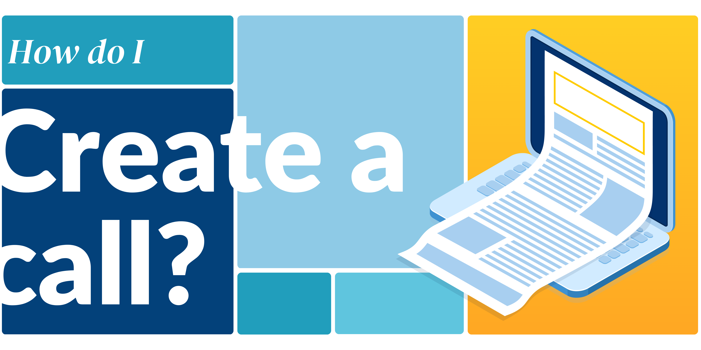
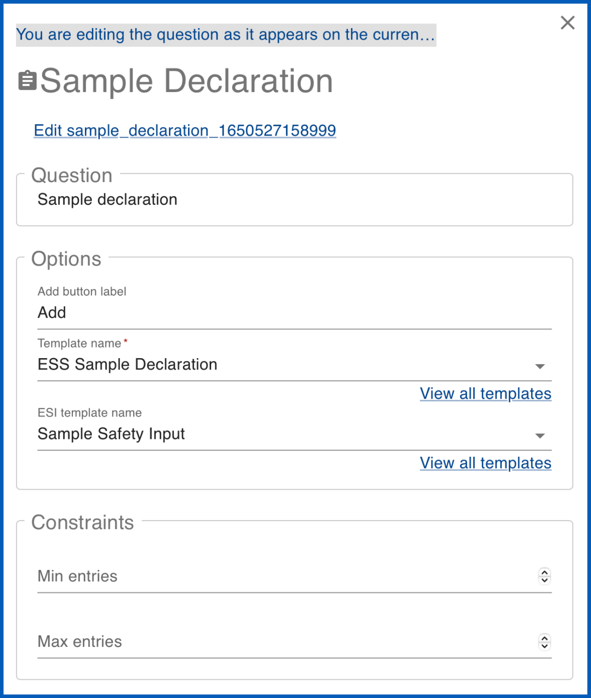
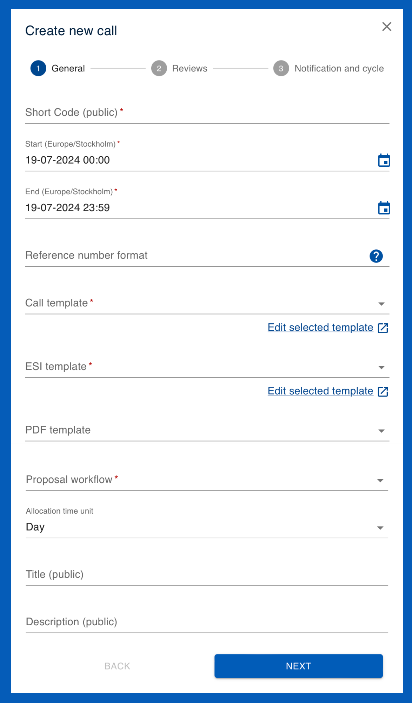
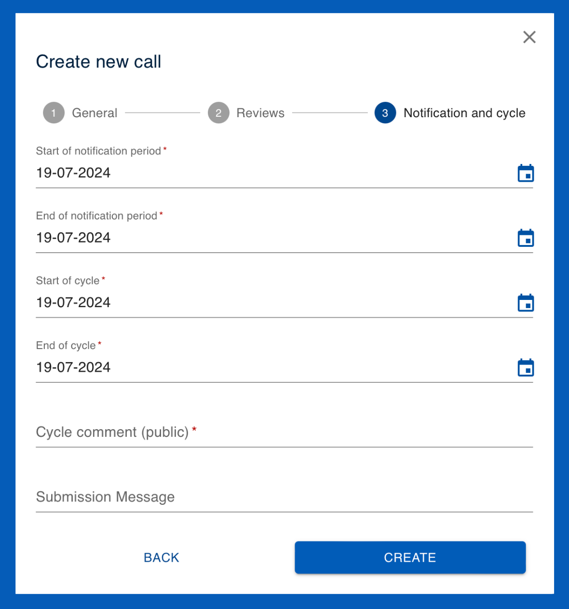
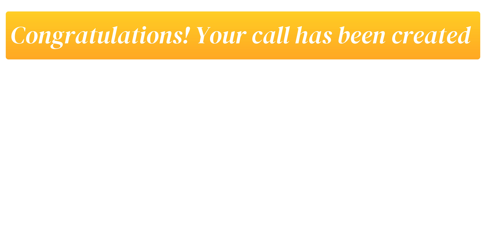

# Creating a call :material-calendar-blank:

## **What are calls?**

**Calls** :material-calendar-blank: allow users’ **proposals** :material-folder-outline: to be submitted and managed within User Office. A call is a period of time during which users can submit proposals to a facility. Calls have a start and an end date and are linked to several different kinds of [**templates :material-text-box-multiple:**](../main/templates.md) (such as [**proposal templates**](../templates/proposal_template.md) which act as the questionnaire that users must fill out when creating their proposals). Calls are assigned to [**FAPs**](../fap.md) (Facility Access Panels) for proposal review and evaluation. Calls are also linked to a [**proposal workflow**](../settings/proposal_workflow.md), which dictates the lifecycle of the proposals within a call. 

* The [**templates** :material-text-box-multiple:](../main/templates.md) allow User Officers to customise calls with specific requirements regarding the type of research users may conduct. Templates also specify and collect the information that users must provide in order to facilitate their research.

* The [**FAP (Facility Access Panel)**](../fap.md) is the group responsible for evaluating users' research proposals which are assigned to proposals and calls.

* The [**proposal workflow**](../settings/proposal_workflow.md) specifies which stages the proposals assigned to the call will go through. This is configured by defining the [**events**](../settings/proposal_workflow.md) that must occur in order for proposals to progress to the next [**status :material-folder-cog-outline:**](../settings/proposal_workflow.md). 

## **Step 1. Setting up the templates, FAP and Proposal Workflow**

### **Templates :material-text-box-multiple:**

In order to set up a call, you must decide which [**templates :material-text-box-multiple:**](../main/templates.md) it will utilise.

**Templates** :material-text-box-multiple: are used to save and re-utilise predefined information across User Office.
**Calls** :material-calendar-blank: are built using several different types of templates which can be **edited** :material-pencil: and **cloned**. Templates serve many different functions; for example, they may contain specific questions which users answer in their proposals. The template system is useful because it saves User Officers from having to create calls from scratch every time. Furthermore, templates allows for standardisation which is essential for data collection and analysis of users' responses.

There are several different types of templates utilised within Calls:

??? info "PDF templates" 
    [**PDF templates**](../templates/pdf_template.md) enable users and User Officers to download proposals in a well-formatted and standardised PDF document for summary and sharing. User Officers can customise PDF templates by adjusting code to modify elements such as font size, colour and other formatting options.

    ______________________________________________________________________________________

    <figure markdown="span">  
        { width="450"}
        <figcaption>**PDF template**</figcaption>
    </figure>

??? info "Proposal templates" 
    [**Proposal templates**](../templates/proposal_template.md) are designed to capture all necessary information that users need to provide when submitting their proposals. These templates generally include questions regarding experiment details, objectives, safety considerations and required resources. Users fill in their answers to these questions in the predefined fields and submit their proposals for review.

    User Officers can also utilise [**question templates**](../questions.md) and [**sub-templates**](../templates/sub_template.md) to customise proposal templates to include specific questions based on the nature and requirements of the research.
    ______________________________________________________________________________________
    <figure markdown="span">  
        { width="450"}
        <figcaption>**Proposal (viewed from the user's perspective)**</figcaption>
    </figure>

??? info "Sample declaration templates" 
    [**Sample declaration templates**](../templates/sampledec_template.md) are designed to collect detailed information about the samples that researchers intend to use in their experiments. The purpose of these templates is to standardise the way sample-related data is gathered, ensuring that all necessary details are captured uniformly across different proposals. These templates are linked to [**proposal templates**](../templates/proposal_template.md) through [**sample declaration question templates**](../questions.md).

    ______________________________________________________________________________________
    <figure markdown="span">  
        { width="450"}
        <figcaption>**Sample declaration question linking to a Sample Delaration Template and Sample Experiment Safety Input (ESI) template**</figcaption>
    </figure>

??? info "Sub templates" 
    [**Sub templates**](../templates/sub_template.md) are used to streamline and organise the creation of complex [**proposal templates.**](../templates/proposal_template.md). They serve as reusable building blocks containing [**question templates**](../questions.md), enabling User Officers to efficiently manage and deploy recurring sets of questions across multiple proposals.

    Sub templates are created by grouping related question templates into a cohesive unit and saving them as a standalone entity. When constructing or modifying a proposal template, User Officers can easily select and insert these sub templates into the appropriate sections, ensuring consistency and reducing the time required to build detailed proposal forms.
    ______________________________________________________________________________________
    <figure markdown="span">  
        { width="450"}
        <figcaption>**Sub template**</figcaption>
    </figure>

??? info "Shipment declaration templates :material-truck:" 
    [**Shipment declaration templates :material-truck:**](../templates/shipment_template.md) are standardised forms used to collect and organise information about parcels being sent to a facility. These templates can be customised to guide users through the process of declaring each shipment, generating labels for package identification, and ensuring compliance with shipping protocols. Each parcel's details, including tracking information and handling instructions, are documented to facilitate smooth and traceable delivery to the facility.

    !!! TIP ""
        **Note**: The shipment declaration form will only become accessible for users to fill out after their proposal status had been set to 'accepted' and the experiment has been allocated a time within the scheduler.
    ______________________________________________________________________________________
    <figure markdown="span">  
        { width="450"}
        <figcaption>**Shipment declaration (viewed from the user's perspective)**</figcaption>
    </figure>

??? info "Visit registration templates :material-airplane-takeoff:" 
    [**Visit registration templates :material-airplane-takeoff:**](../templates/visit_template.md) are predefined forms used to gather and organise information from visitors planning to access a research facility. These templates collect essential details regarding visitor accomodation needs, arrival and departure dates, and on-site access, ensuring that the visit is properly coordinated and compliant with facility protocols.

    !!! TIP ""
        **Note**: The visit registration form will only become accessible for users to fill out after their proposal status had been set to 'accepted' and the experiment has been allocated a time within the scheduler.
    ______________________________________________________________________________________
    
    <figure markdown="span">  
        { width="450"}
        <figcaption>**Visit reigstration (viewed from the user's perspective)**</figcaption>
    </figure>

??? info "Proposal ESI templates" 
    [**Proposal Experiment Safety Input (ESI)**](../templates/proposalESI_template.md) are designed to collect and document safety-related information for research proposals, ensuring that all necessary safety considerations are addressed before the experiment begins. User Officers can use ESI templates to gather details about potential hazards, risk assessments, safety measures, and compliance with regulatory standards. This structured approach helps in maintaining a safe research environment and ensures that all safety protocols are thoroughly evaluated and documented. User Officers can also utilise [**question templates**](../questions.md) and [**sub-templates**](../templates/sub_template.md) to customise Proposal ESI templates. This form is available after the users experiment has been accepted and scheduled so that users may review and confirm the safety information in case of any changes made to the experiment.

    !!! TIP ""
        **Note**: The Proposal ESI form will only become accessible for users to fill out after their proposal status had been set to 'accepted' and the experiment has been allocated a time within the scheduler.
    ______________________________________________________________________________________
    
    <figure markdown="span">  
        { width="450"}
        <figcaption>**Proposal ESI (viewed from the user's perspective)**</figcaption>
    </figure>

??? info "Sample ESI templates :material-inbox:" 
    [**Sample Experiment Safety Input (ESI) templates :material-inbox:**](../templates/sampleESI_template.md) are predefined forms used to collect safety-related information about the samples involved in an experiment. These templates are added to [**proposal templates**](../templates/proposal_template.md) through [**sample declaration question templates**](../questions.md), ensuring that all safety considerations, such as potential hazards or special handling requirements, are thoroughly documented and assessed as part of the proposal submission process. 
    ______________________________________________________________________________________
    
    <figure markdown="span">  
        { width="450"}
        <figcaption>**Sample ESI template**</figcaption>
    </figure>

??? info "Feedback templates :material-message-alert:" 
    [**Feedback templates :material-message-alert:**](../templates/feedback_template.md) are structured questionnaires used to collect feedback from users about their experiments and overall experience at the facility. These templates allow users to provide insights and evaluations, which help the facility improve its services and address any issues.

    !!! TIP ""
        **Note**: The feedback form will only become accessible for users to fill out after their proposal status had been set to 'accepted' and the experiment has been allocated a time within the scheduler.
    ______________________________________________________________________________________
    
    <figure markdown="span">  
        { width="450"}
        <figcaption>**Feedback form (viewed from the user's perspective)**</figcaption>
    </figure>

**How do I use templates within a call?**

When it comes to utilising templates within a call there are various options:

**1. Use a pre-existing template**

To use a pre-existing template, simply select it from the drop-down menu within the call. 

**Note:** [**Shipment declaration templates**](../templates/shipment_template.md), [**visit registration templates**](../templates/visit_template.md) and [**feedback templates**](../templates/feedback_template.md) do not appear within the call creation page. To select which of each of these templates you would like to utilise, find their page on the main menu and use the `MARK AS ACTIVE` function to specify which should be currently utilised. 

!!! tip ""
    **TIP:** It is good practice to check the templates you wish to use before finalising the creation of the call. You can view the template details in the designated template edit page, found by navigating to the templates menu.

**2. Edit a pre-existing template**

To edit pre-existing [**Proposal templates**](../templates/proposal_template.md) and [**Proposal ESI templates**](../templates/proposalESI_template.md) directily from the call, click on `EDIT SELECTED TEMPLATE`. For all other templates, navigate to the templates menu, click on the desired template type and `SEARCH` :material-magnify: for the name of the template you wish to make changes to. You can then make changes to the template within the template editor.

Alternatively, you can also `CLONE` the template and `EDIT` :material-pencil: the new cloned version if you wish to keep the original template as it is. Note: the clone will be renamed 'Copy of (name) Template' and will be edded to the end of the list of templates

For further information on editing templates for calls, see the specific template creation guides below for an overview of each template's features.

**3. Create a template**

Lastly, you may also create templates to fully customise them to fit the research needs: 

* [**How do I create PDF templates?**](../templates/pdf_template.md)

* [**How do I create proposal templates?**](../templates/proposal_template.md)

* [**How do I create sample declaration templates?**](../templates/sampledec_template.md)

* [**How do I create sub templates?**](../templates/sub_template.md)

* [**How do I create shipment declaration templates?**](../templates/shipment_template.md)

* [**How do I create visit registration templates?**](../templates/visit_template.md)

* [**How do I create proposal ESI templates?**](../templates/proposalESI_template.md)

* [**How do I create sample ESI templates?**](../templates/sampleESI_template.md)

* [**How do I create Feedback templates?**](../templates/feedback_template.md)

### **FAPs**

Calls are also assigned to Facility Access Panel(s) (FAPs) for review of the submitted proposals, which must be selected within the call.

??? info "FAPs" 
    [**Facility Access Panels (FAPs)**](../fap.md) are groups of external reviewers responsible for evaluating research proposals. These panels consist of experts who assess the feasibility, significance, and resource requirements of the proposals. Each FAP typically includes a **reviewer**, **secretary** and **chair** to oversee the review process and ensure thorough and unbiased evaluation. FAPs play a crucial role in maintaining the integrity and quality of the proposal review process by providing independent and specialised assessments.

    User Officers can manage the FAPs assigned to proposals and calls. FAPs can be utilised across multiple proposals, helping streamline the organisation and operation of the review process. This ensures that proposals are evaluated efficiently and according to standardised criteria such as the **grade guide**. In creating a FAP, user officers may provide general information by labeling FAPs with a code, a description, and specifying the required number of proposal ratings. 

    ______________________________________________________________________________________
    
    <figure markdown="span">  
        { width="450"}
        <figcaption>**FAP General Information**</figcaption>
    </figure>

**How do I use FAPs within a call?** 

There are several ways to assign a FAP to a call:

**1. Use pre-existing FAPs**

To utilise a pre-existing FAP within a call, simply select it from the 'Call FAPs' drop-down menu in the 'Reviews' section of the call. Note: multiple FAPs can be selected within a single call. 

**2. Create FAPs**

You may also create new FAPs if they have not yet been defined within the User Office System.

* [**How do I create FAPs?**](../fap.md)

### **Proposal Workflows**

Calls utilise proposal workflow 

??? info "Proposal Workflows" 

    [**Proposal workflows**](../settings/proposal_workflow.md) outline the sequential steps a proposal follows from draft to final decision represented by statuses, such as '**Draft**', '**Feasibility Review**', '**Allocated**', '**Not Allocated**', '**Reserved**', and '**Rejected**'. Each status marks a key stage in the proposal's progression. For example, moving from 'Draft' to 'Feasibility Review' indicates the proposal's readiness for preliminary assessment. 

    Proposal workflows control how and when the User Office system will display information to different roles based on statuses. The workflow manages how proposals are processed, with User Officers defining the statuses and events that guide proposals through their lifecycle. Events triggering status transitions include user submissions, call deadlines, feasibility reviews, and User Officers' decisions. User Officers can customise workflow templates by adding, removing or modifying statuses to fit specific needs, such as including 'Technical Review' or 'FAP Review' stages. Proposal workflows ensure systematic processing of proposals, allowing User Officers to track statuses and set up automatic notifications for users' proposals at different stages of review.

    ______________________________________________________________________________________
    
    <figure markdown="span">  
        { width="450"}
        <figcaption>**Proposal workflow**</figcaption>
    </figure>

**How do I use proposal workflows within a call?**

There are several ways to assign a Proposal Worklow to a call:

**1. Use pre-existing Proposal Workflows**

To utilise a pre-existing Proposal workflow within a call, simply select it from the 'Proposal Workflow' drop-down menu in the 'General' section of the call. 

**2. Create Proposal Workflows**

You may also create new Proposal Workflow to fit the workflow needs:

* [**How do I create Proposal Workflows?**](../settings/proposal_workflow.md)

## **Step 2. Filling out the call contents** 

Once you have the necessary templates, FAPs and a Proposal Workflow defined for your call, you may begin to fill out the call information:

Start by creating a Call with the `CREATE CALL` button.
When creating a call, the 'Create a call' page will pop-up and display three sections: **General**, **Reviews** and **Notification and cycle**.
You can navigate between the sections by clicking on the headings or `NEXT` and `BACK` buttons.

### **1. General**
!!! note ""

    This is the section where you specify the general information about the call, including:

    { align=left width="350"}

    * **Short code (public):** The call short code which will be publicly displayed 

    * **Start date:** The date the Call opens and is ready for proposal submission

    * **End date:** The date the Call ends; i.e., the users' proposal submission deadline
     
    * **Reference number format:** The reference number format that determines how reference numbers are generated.

    * **Call template:** The proposal template that the call will utilise.

    * **ESI template:** The Experimental Safety Input (ESI) template the call will utilise.

    * **Proposal workflow:** The workflow that the Proposal will follow.

    * **Allocation time unit:** The unit of time the allocation will be in (Hours, Days or Weeks) 

    * **Title (public):** The name of the Call which will be publicly displayed 

    * **Description (public):** The description of the Call which will be publicly displayed

### **2. Reviews**
!!! note ""

    In this section you can specify the review process:

    { align=left width="350"}

    * **Sart of review:** Start date of the feasibility review

    * **End of review:** End date of the feasibility review

    * **Start of FAP review:** Start date of FAP review

    * **End of FAP review:** End date of FAP review

    * **Call FAPs:** The FAPs that will be involved in the review of the proposals submitted to the call

    * **Survey comment:** 

### **3. Notification and cycle**
!!! note ""

    Finally, this section allows you to specify information regarding notifications and cycle:

    { align=left width="350"}

    * **Start of notification period:** The start of the period in which emails are sent to users regarding the result of their proposal

    * **End of notification period:** The end of the period in which emails are sent to users regarding the result of their proposal

    * **Start of cycle:** Start date of cycle

    * **End of cycle:** End date of cycle

    * **Cycle comment (public):** 

    * **Submission message:** This is the message that is displayed to users upon proposal submission

## **Step 3. Creating the call**
Finally, before creating the call please ensure you have done the following: 

!!! tip ""

    **TIP:** Call checklist:

    - Have I checked all the templates?

    - Have I checked all the dates are correct? 

    - Have I checked which shipment, registration and feedback templates are marked as active?  

    - Have I checked that the user help page and FAQ pages contain all the necessary information for users?

Note: It is possible to edit call information after a call has been created, but please refer to the best practice information on [editing active calls](../calls.md).

Lastly, once you have filled out all of the call information, checked that it is correct and reviewed the call checklist you may now create the call by clicking the `CREATE` button on the Notification and Cycle page.

<figure markdown="span">  
    { width="500"}

