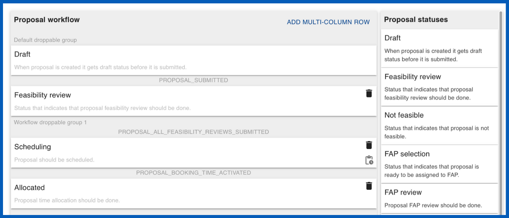

# Creating a workflow :material-sitemap:

## What are proposal workflows?

[Proposal workflows :material-sitemap:](../settings/proposal_workflow.md) outline the sequential steps a proposal follows from draft to final decision represented by statuses, such as '**Draft**', '**Feasibility Review**', '**Allocated**', '**Not Allocated**', '**Reserved**', and '**Rejected**'. Each status marks a key stage in the proposal's progression. For example, moving from '**Draft**' to '**Feasibility Review**' indicates the proposal's readiness for preliminary assessment. 

Proposal workflows control how and when the User Office system will display information to different roles based on statuses. The workflow manages how proposals are processed, with User Officers defining the statuses and events that guide proposals through their lifecycle. Events triggering status transitions include user submissions, call deadlines, feasibility reviews, and User Officers' decisions. User Officers can customise workflow templates by adding, removing or modifying statuses to fit specific needs, such as including 'Technical Review' or 'FAP Review' stages. Proposal workflows ensure systematic processing of proposals, allowing User Officers to track statuses and set up automatic notifications for users' proposals at different stages of review.

______________________________________________________________________________________
    
<figure markdown="span">  
        { width="600"}
        <figcaption>Proposal workflow</figcaption>
    </figure>

## Proposal statuses :material-folder-cog-outline:

??? info "Proposal statuses" 

    **Draft** when the proposal is created it gets a draft status before it is submitted.

    **Feasibility review** indicates that proposal [feasibility review :octicons-checklist-16:](feasibility_review.md) should be done.

    **Not feasible** indicates that the proposal is not feasible (as assessed by the [feasibility review :octicons-checklist-16:](feasibility_review.md))

    **FAP selection** indicates that the proposal is ready to be assigned to a [FAP :material-google-circles-communities:](../fap.md)

    **FAP review** indicates that the proposal [FAP review :material-google-circles-communities:](fap_review.md) should be done

    **Allocated** indicates that proposal time allocation should be done

    **Not allocated** indicates that the proposal is not allocated

    **Scheduling** indicates that the proposal should be scheduled

    **Expired** indicates that the proposal has expired

    **FAP meeting** indicates that the proposal is in FAP meeting for evaluation

    **Rejected** indicates that the proposal is rejected

    **Feasibility and sample review** indicates that the proposal feasibity and sample review can be done simultaneously

    **Sample review** indicates that proposal [sample review :material-package-variant-closed:](../sample_safety.md) can be done

    **Management decision** indicates that the proposal is ready for management decision

    **Reserved** indicates that the proposal is on the reserved list

### Status events

??? info "Status events" 

    **Status Events** are the events that will trigger changes to statuses. 
    
    For example, in a **rapid access workflow** the **Call ended** status event (which occurs on a specific call end date set within the call) will trigger the change to **feasibility review** status, meaning that when the call ends, the proposal will automatically be available for feasibility review.

    * Status events can be set by clicking on the statuses within the workflow.

    Status events for **draft** statuses cannot be set. 

### Status actions

??? info "Status actions" 

    **Status Actions** are communication tools which can be configured to automatically send Emails and RabbitMQ messages when a proposal reaches a certain status.

## Step 1: Set up the proposal statuses

* Go to the **main menu** :material-menu: and select **Settings** :material-cog:
* From the dropdown menu, choose [Proposal workflows :material-sitemap:](../settings/proposal_workflow.md)

* On the Proposal Workflows page, click the ^^`CREATE`^^ button
* Enter a name and description for your new Proposal Workflow
* Click ^^`CREATE`^^ to proceed

* The Proposal Workflow Editor will open. From this page, you can set up the Proposal Workflow.

> **_NOTE:_** You can **drag and drop** [proposal Statuses :material-folder-cog-outline:](../settings/proposal_statuses.md) into the Proposal Workflow, reordering them as desired. The order of the statuses represent the workflow that the proposal will progress through. 

 Delete statuses to remove them from the workflow. The 'Draft' Status is a mandatory starting status for all proposals and cannot be deleted or have other statuses precede it.

## Step 2. Set up the status events and actions

## Step 3. Create the proposal workflow

* Once you are satisfied with your edits, click the Update button to save and apply the changes to the PDF template

