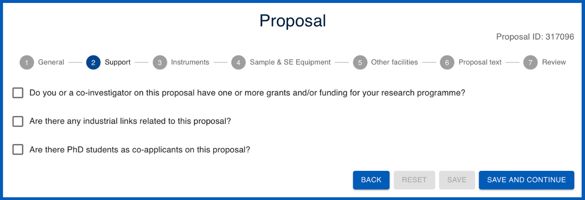
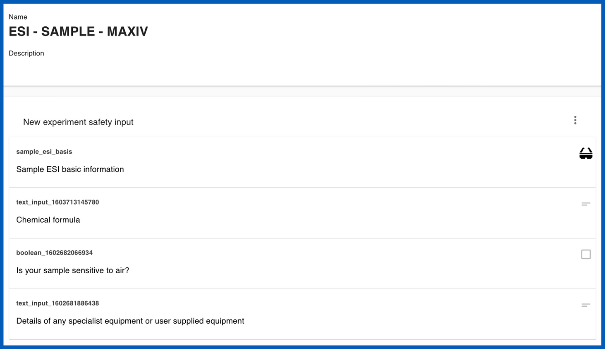

# Creating templates :material-text-box-multiple:

## **What are templates?**

Templates :material-text-box-multiple: are used to save and re-utilise predefined information across User Office. Calls are built using several different types of templates which can be edited and cloned. Templates carry information and serve many functions; for example, they may contain specific questions to be used within the call which users answer in their proposals. The template system is useful because it saves you having to do all the work from scratch every time. Furthermore, it allows for standardisation which is essential for data collection and analysis.

There are several different types of templates utilised within Calls:

## **What are the different types of templates?**

??? info "PDF templates :material-file-pdf-box:" 
    [**PDF templates** :material-file-pdf-box:](../templates/pdf_template.md) enable users and User Officers to download proposals in a well-formatted and standardised PDF document for summary and sharing. User Officers can customise PDF templates by adjusting code to modify elements such as font size, colour and other formatting options.

    ______________________________________________________________________________________

    <figure markdown="span">  
        { width="450"}
        <figcaption>**PDF template**</figcaption>
    </figure>

??? info "Proposal templates :material-note-text:" 
    [**Proposal templates** :material-note-text:](../templates/proposal_template.md) are designed to capture all necessary information that users need to provide when submitting their proposals. These templates generally include questions regarding experiment details, objectives, safety considerations and required resources. Users fill in their answers to these questions in the predefined fields and submit their proposals for review.

    User Officers can also utilise [**questions** :material-comment-question:](../questions.md) and [**sub-templates** :material-collapse-all-outline:](../templates/sub_template.md) to customise proposal templates to include specific questions based on the nature and requirements of the research.
    ______________________________________________________________________________________
    <figure markdown="span">  
        { width="450"}
        <figcaption>**Proposal (viewed from the user's perspective)**</figcaption>
    </figure>

??? info "Sample declaration templates :material-inbox:" 
    [**Sample declaration templates** :material-inbox:](../templates/sampledec_template.md) are designed to collect detailed information about the samples that researchers intend to use in their experiments. The purpose of these templates is to standardise the way sample-related data is gathered, ensuring that all necessary details are captured uniformly across different proposals. These templates are linked to [**proposal templates** :material-note-text:](../templates/proposal_template.md) through **sample declaration** [**questions** :material-comment-question:](../questions.md).

    ______________________________________________________________________________________
    <figure markdown="span">  
        { width="450"}
        <figcaption>**Sample declaration question linking to a Sample Delaration Template and Sample Experiment Safety Input (ESI) template**</figcaption>
    </figure>

??? info "Sub templates :material-collapse-all-outline:" 
    [**Sub templates** :material-collapse-all-outline:](../templates/sub_template.md) are used to streamline and organise the creation of complex [**proposal templates.**](../templates/proposal_template.md). They serve as reusable building blocks containing [**questions**](../questions.md), enabling User Officers to efficiently manage and deploy recurring sets of questions across multiple proposals.

    Sub templates are created by grouping related question templates into a cohesive unit and saving them as a standalone entity. When constructing or modifying a proposal template, User Officers can easily select and insert these sub templates into the appropriate sections, ensuring consistency and reducing the time required to build detailed proposal forms.
    ______________________________________________________________________________________
    <figure markdown="span">  
        { width="450"}
        <figcaption>**Sub template**</figcaption>
    </figure>

??? info "Shipment declaration templates :material-truck:" 
    [**Shipment declaration templates :material-truck:**](../templates/shipment_template.md) are standardised forms used to collect and organise information about parcels being sent to a facility. These templates can be customised to guide users through the process of declaring each shipment, generating labels for package identification, and ensuring compliance with shipping protocols. Each parcel's details, including tracking information and handling instructions, are documented to facilitate smooth and traceable delivery to the facility.

    !!! TIP ""
        **Note**: The shipment declaration form will only become accessible for users to fill out after their proposal status had been set to 'accepted' and the experiment has been allocated a time within the scheduler.
    ______________________________________________________________________________________
    <figure markdown="span">  
        { width="450"}
        <figcaption>**Shipment declaration (viewed from the user's perspective)**</figcaption>
    </figure>

??? info "Visit registration templates :material-airplane-takeoff:" 
    [**Visit registration templates :material-airplane-takeoff:**](../templates/visit_template.md) are predefined forms used to gather and organise information from visitors planning to access a research facility. These templates collect essential details regarding visitor accomodation needs, arrival and departure dates, and on-site access, ensuring that the visit is properly coordinated and compliant with facility protocols.

    !!! TIP ""
        **Note**: The visit registration form will only become accessible for users to fill out after their proposal status had been set to 'accepted' and the experiment has been allocated a time within the scheduler.
    ______________________________________________________________________________________
    
    <figure markdown="span">  
        { width="450"}
        <figcaption>**Visit reigstration (viewed from the user's perspective)**</figcaption>
    </figure>

??? info "Proposal ESI templates :material-note-text:" 
    [**Proposal Experiment Safety Input (ESI)** :material-note-text:](../templates/proposalESI_template.md) are designed to collect and document safety-related information for research proposals, ensuring that all necessary safety considerations are addressed before the experiment begins. User Officers can use ESI templates to gather details about potential hazards, risk assessments, safety measures, and compliance with regulatory standards. This structured approach helps in maintaining a safe research environment and ensures that all safety protocols are thoroughly evaluated and documented. User Officers can also utilise [**questions**](../questions.md) and [**sub-templates**](../templates/sub_template.md) to customise Proposal ESI templates. This form is available after the users experiment has been accepted and scheduled so that users may review and confirm the safety information in case of any changes made to the experiment.

    !!! TIP ""
        **Note**: The Proposal ESI form will only become accessible for users to fill out after their proposal status had been set to 'accepted' and the experiment has been allocated a time within the scheduler.
    ______________________________________________________________________________________
    
    <figure markdown="span">  
        { width="450"}
        <figcaption>**Proposal ESI (viewed from the user's perspective)**</figcaption>
    </figure>

??? info "Sample ESI templates :material-inbox:" 
    [**Sample Experiment Safety Input (ESI) templates :material-inbox:**](../templates/sampleESI_template.md) are predefined forms used to collect safety-related information about the samples involved in an experiment. These templates are added to [**proposal templates**](../templates/proposal_template.md) through [**sample declaration question templates**](../questions.md), ensuring that all safety considerations, such as potential hazards or special handling requirements, are thoroughly documented and assessed as part of the proposal submission process. 
    ______________________________________________________________________________________
    
    <figure markdown="span">  
        { width="450"}
        <figcaption>**Sample ESI template**</figcaption>
    </figure>

??? info "Feedback templates :material-message-alert:" 
    [**Feedback templates :material-message-alert:**](../templates/feedback_template.md) are structured questionnaires used to collect feedback from users about their experiments and overall experience at the facility. These templates allow users to provide insights and evaluations, which help the facility improve its services and address any issues.

    !!! TIP ""
        **Note**: The feedback form will only become accessible for users to fill out after their proposal status had been set to 'accepted' and the experiment has been allocated a time within the scheduler.
    ______________________________________________________________________________________
    
    <figure markdown="span">  
        { width="450"}
        <figcaption>**Feedback form (viewed from the user's perspective)**</figcaption>
    </figure>

______________________________________________________________________________________

## **How do I use templates within a call?**

* [How do I use templates within a call?](creating_call.md)

______________________________________________________________________________________
