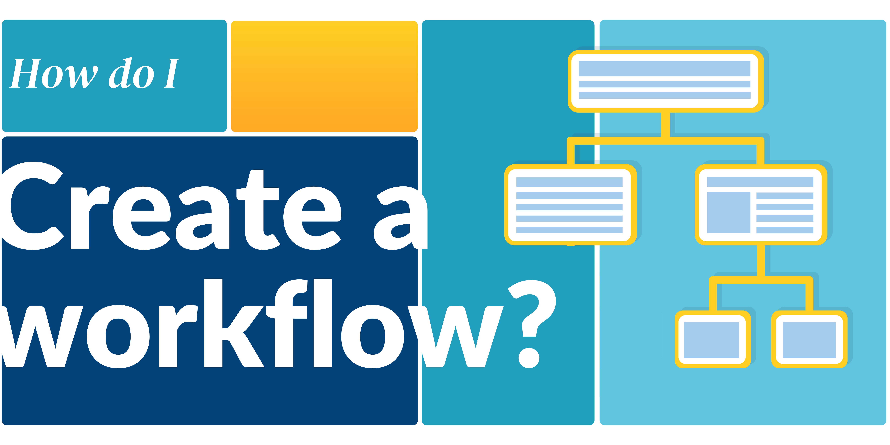
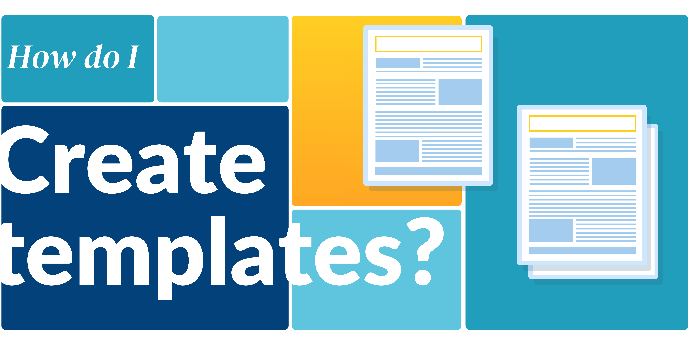

__________________________________________________________________________

{ width="400" align=right } 
!!! info inline end ""
    [Create a call :material-calendar-blank:](creating_call.md){ .md-button .md-button--primary }
    
    Calls  allow users’ proposals  to be submitted and managed within User Office. A call is a period of time during which users can submit proposals to a facility. 
    _______________________________________________________

{ width="400" align=right } 
!!! info inline end ""
    [Create a workflow :material-sitemap:](../settings/proposal_workflow.md){ .md-button .md-button--primary }

    Proposal workflows manages how proposals are processed, with User Officers defining the statuses and events that guide proposals through their lifecycle.
    _______________________________________________________
    
{ width="400" align=right } 
!!! info inline end ""
    [Create templates :material-text-box-multiple:](creating_templates.md){ .md-button .md-button--primary }

    Templates are used to save and re-utilise predefined information across User Office. Calls are built using several different types of templates.
    _______________________________________________________
    
## Quick start
__________________________________________________________________________

Overview and intruduction to User Office:

- [Part I: How do I create templates?](creating_templates.md)

- [Part II: How do I use workflows?](../settings/proposal_workflow.md)

- [Part III: How do I create a call?](creating_call.md)

