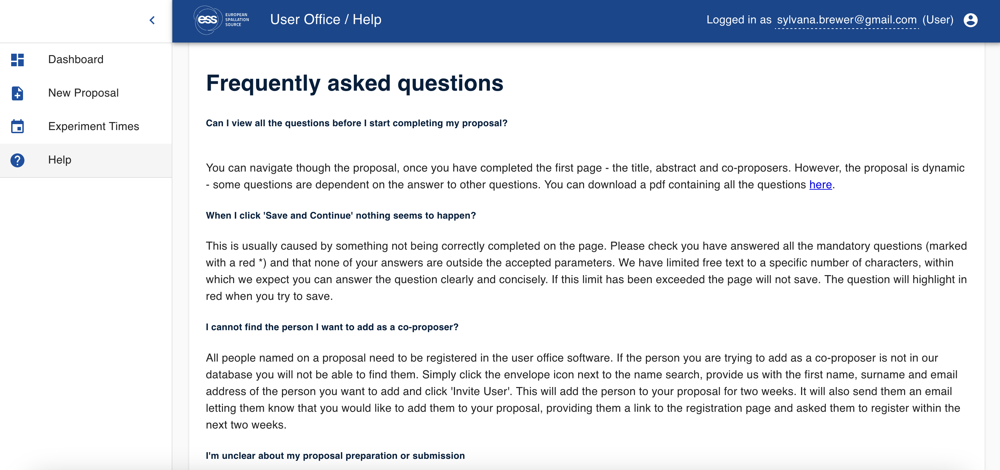
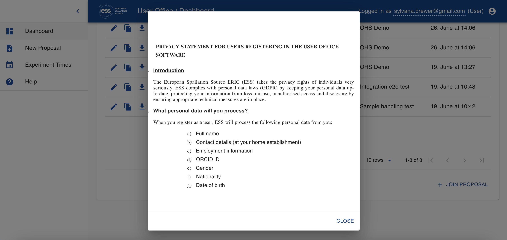

# Pages :material-cog-box:

## **What are pages?**

Pages are highly customiseable sections of information within User Office. Pages can be utilised to display key dates, advice and links to users and reviewers. 

## **How do I edit pages?**

**Step 1. Navigate to the Page editor**

* To edit a page, select `PAGES` :material-cog-box: from the main menu
* From the Page Editor, choose the page you wish to edit

**Step 2. Edit the page**

* To create a new page click on `FILE` > `NEW DOCUMENT`, or edit the pre-existing message.
* The editor contains many useful features to aid in creating the page such as `EDITING` and `FORMATTING` tools.
* The `INSERT` button can also be used to insert images and links into the page.

!!! tip ""

    **Tip!** It is good practice to carefully check the preview before updating the page to ensure that it is well formatted. You can do this in `VIEW` > `PREVIEW`

### **User**

!!! note ""
    **User page:** This sets the users' homepage; this is the information that users will see on their dashboard.   
    This may include the following key information: 
    
    * A welcome message to users
    * Key dates
    * Information on the proposal process 
    * Important links (e.g., to publication guidelines)

    _____________________________________________________________________________________________________________

    <figure markdown="span">  
        
        <figcaption>**User homepage (dashboard)**</figcaption>
    </figure>

### **Reviewer**

!!! note ""
    **Reviewer page:** This sets the reviewers' homepage; this is the information that reviewers will see on their dashboard (This is displayed to the following roles: [Sample Safety Reviewer](roles.md), [Internal Reviewer](roles.md), [FAP chairs](roles.md), [FAP secretaries](roles.md) and [FAP reviewers](roles.md)).

    The reviewer page may include the following key information: 

    * A welcome message to reviewers 
    * Key dates
    * Information on the review process 
    * Important links 

    _____________________________________________________________________________________________________________

    <figure markdown="span">  
        
        <figcaption>**Reviewer homepage (dashboard)**</figcaption>
    </figure>

### **Help**

!!! note ""
    **Help page:** This sets the help page; this is the information that is displayed to users on the 'help' page, and at the FAQ button at the bottom of the page for all users. See the 'FAQs for help page section for an list of example questions that may be useful to include in the help page.
    
    ??? info "FAQs for help page"
        Frequently asked questions: 

        * **Can I view all the questions before I start completing my proposal?**

        You can navigate though the proposal, once you have completed the first page - the title, abstract and co-proposers. However, the proposal is dynamic - some questions are dependent on the answer to other questions. You can download a pdf containing all the questions here (link).

        * **When I click 'Save and Continue' nothing seems to happen?**

        This is usually caused by something not being correctly completed on the page. Please check you have answered all the mandatory questions (marked with a red *) and that none of your answers are outside the accepted parameters. We have limited free text to a specific number of characters, within which we expect you can answer the question clearly and concisely. If this limit has been exceeded the page will not save. The question will highlight in red when you try to save.

        * **I cannot find the person I want to add as a co-proposer?**

        All people named on a proposal need to be registered in the user office software. If the person you are trying to add as a co-proposer is not in our database you will not be able to find them. Simply click the envelope icon next to the name search, provide us with the first name, surname and email address of the person you want to add and click 'Invite User'. This will add the person to your proposal for two weeks. It will also send them an email letting them know that you would like to add them to your proposal, providing them a link to the registration page and asked them to register within the next two weeks. 

        * **I'm unclear about my proposal preparation or submission**

        If you are having difficulties preparing the science content for your proposal, please find out more on the website (link) or contact (email address).

        If you are having difficulties using the online proposal submission system, or have feedback about this software, please contact (email address).

        * **Can I edit/view my personal information and change my password?**

        Yes! Click on the head icon on the top right-hand corner of the screen. This will open your personal information - you can view and edit your details. You can also change your password. Please remember that the password needs to be 8 characters and include upper case, lower case letters and numbers. 

        * **How can I confirm an email I receive is from the User Office Software?**

        We cannot guarentee that our email address is no mimicked by phising scams. However, there are some features you will find in all our emails. Our salutation will always be 'Dear PreferredName LastName,' . The only exception is our initial confirmation of registration message and our password reset message. Our messages will always include the ESS visiting and postal addresses in a signature and this text will be in ESS blue. 

        We will never ask you to put personal information in to an email from the User Office Software. If you every feel unsure, please contact useroffice@ess.eu.

    _____________________________________________________________________________________________________________

    <figure markdown="span">  
        
        <figcaption>**User help page (FAQ)**</figcaption>
    </figure>

    <figure markdown="span">  
        
        <figcaption>**Help notice (FAQ)**</figcaption>
    </figure>

### **Privacy**

!!! note ""
    **Privacy Agreement page:** This sets the privacy agreement page; this is the information that is displayed when clicking on the `PRIVACY STATEMENT` button at the bottom of all pages.

    <figure markdown="span">  
        
        <figcaption>**Privacy Agreement Page**</figcaption>
    </figure>

### **Footer**

!!! note ""
    [Footer (developer tool)](developer-guide.md)
    Note: The page must be refreshed in order to view the updated footer. 

### **Login**

!!! note ""
    [Login (developer tool)](developer-guide.md)

### **Grade guide** 

!!! note ""
    **Grade guide:** This sets the grade guide. Note: this is different from the grade guide in the FAP page

**Step 3. Update your changes**

* Once you are satisfied with the changes and ensured that the page is well-formatted with the `PREVIEW` function you can update the page by clicking on the `UPDATE` button.
_________________________________________________________________________________________________________

