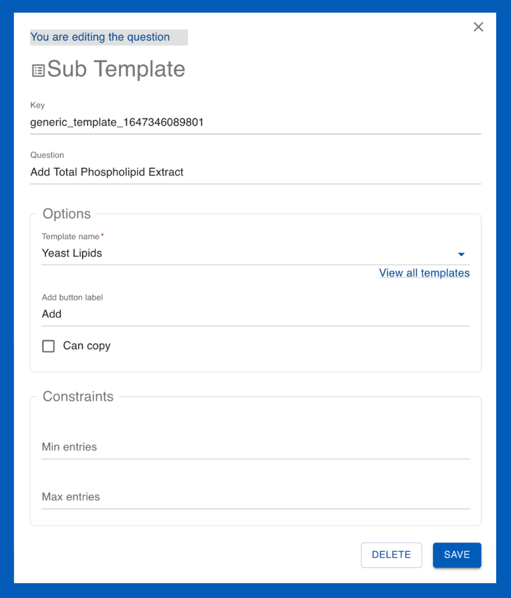
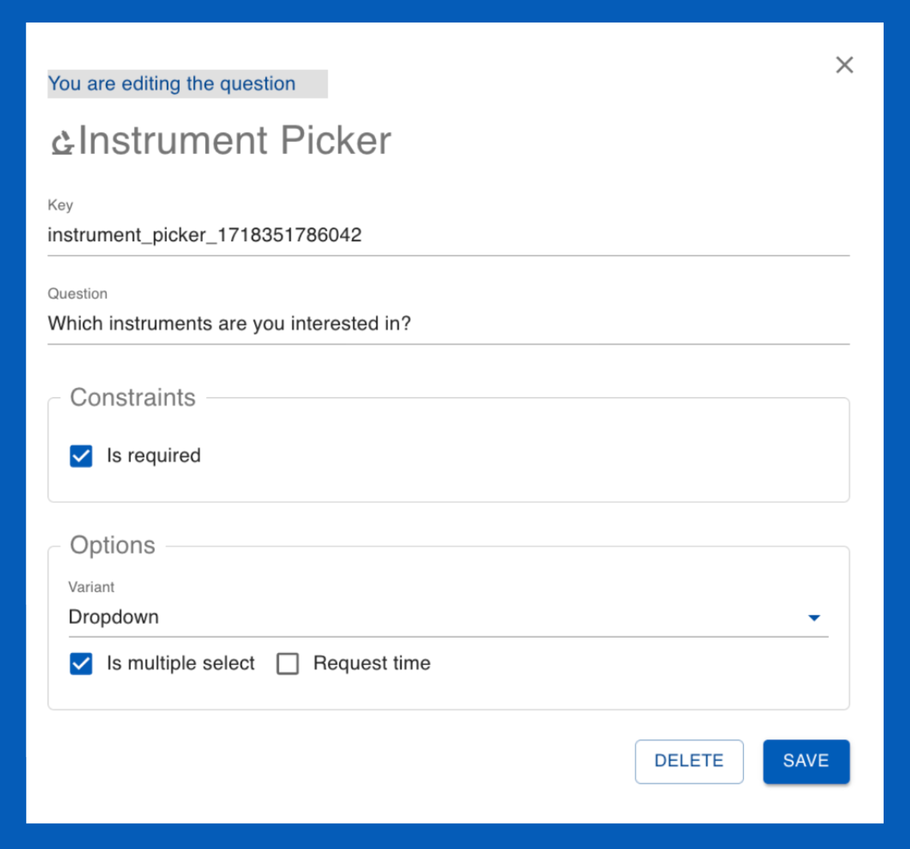

# Questions :material-comment-question:

_________________________________________________________________________________________________________

## What are questions?

Questions :material-comment-question: are designed to streamline the template creation process and ensure consistency across users' submissions. Question allow users to provide detailed and structured responses. User Officers can create various types of questions, which are stored in the the **question drawer**. Questions allow for standardisation across multiple templates which is essential for data collection and analysis of users' responses.

Questions can be utilised within the following templates:

* [Proposal templates :material-note-text:](templates/proposal_template.md)
* [Proposal ESI templates :material-note-text:](templates/proposalESI_template.md)
* [Sample ESI templates :material-inbox:](templates/sampleESI_template.md)
* [Feedback templates :material-message-alert:](templates/feedback_template.md)
* [Sub Templates :material-collapse-all-outline:](templates/sub_template.md)
* [Sample declaration templates :material-inbox:](templates/sampledec_template.md)
* [Shipment declaration templates :material-truck:](templates/shipment_template.md)
* [Visit registration templates :material-airplane-takeoff:](templates/visit_template.md)

_________________________________________________________________________________________________________

## How do I edit questions?

When editing a quesiton you have two options:

* Edit the question as it appears within the current template (i.e, only for this one instance).
* Edit the question within the question drawer (across all templates).

_________________________________________________________________________________________________________

## How do I create questions?

* In the main menu, navigate to the template page you wish to create the question within
([Proposal templates :material-note-text:](templates/proposal_template.md), [Proposal ESI templates :material-note-text:](templates/proposalESI_template.md), [Sample ESI templates :material-inbox:](templates/sampleESI_template.md), [Feedback templates :material-message-alert:](templates/feedback_template.md), [Sub Templates :material-collapse-all-outline:](templates/sub_template.md), [Sample declaration templates :material-inbox:](templates/sampledec_template.md), [Shipment declarationt templates :material-truck:](templates/shipment_template.md), [Visit registration templates :material-airplane-takeoff:](templates/visit_template.md))

* Within the chosen template page, create or edit a pre-existing template. 
(In this example, we wish to create questions for a Proposal template:)

> **_NOTE:_**  The basic question which appears at the beginning of each template type, for example proposal basic within proposal questionnaire templates contain essential questions for that template type)

* This will open the template editor. From here, you can create a question by clicking on the three dots {options} button and selecting **add question** to the topic. Topics are the sections of the template. You can create more topics by selecting **add topics**.

* Selecting **add question** will open the **question drawer**. Click on the three dots {options} within the question drawer; this will open a menu listing the different types of questions you can create. 

Note: depending on which template you are creating questions for, certain questions may be limited. For example, you may not add a sample declaration question type to a visit registration template.

* Once you have put the questions in the template, you can click on them to edit (as they appear on the current template) to edit them in the question drawer.

It is good practice to utilise pre-existing question templates when possible. This allows for the collection of users' answer data to be standardized for analysis.

_________________________________________________________________________________________________________

## What are the different question types?

??? info "Boolean :material-square-outline:"

    { align=left width="350"}

    **Boolean:** A checkbox question type which can have one of the two possible values; true or false ('Yes' or 'No')

    * **Key:** The question key

    * **Question:** Fill in your question (It should be clear a 'yes' or 'no' answer applicable to the checkbox)

    **Contraints:**

    * **User must check it to continue:** enabling this constraint means that the user must check the box in order to continue filling out (and submit) their proposal. This is useful to use in questions that must be agreed to such as 'I acknowledge this is an Expression of Interest' or 'I agree to the terms and conditions'.

??? info "Date :material-calendar-today:"
    **Date:**

    { align=left width="350"}

    Allows users to specify a date which can be selected from a calendar tool 

    * **Key:** The question key

    * **Question:** Fill in your question (it should relate to the date; e.g., please specify a delivery date) 

    * **Include time:** This refers to including a specific time (in hours, minutes) for the date

    * **Tooltip:** This is text that appears to help the user. In this case it appears below the field where users specify the date. (tooltip image)

    **Constraints:**

    * **Is required:** enabling this constraint allows you to define a valid date range. Min refers to the earliest date and Max refers to the latest date which can be chosen. Default is the date the calendar will be set to by default when the user goes to select the date. *Note: leaving these fields empty allows the user to chose any date*

??? info "Embellishment :material-format-size:"
    **Embellishment:**

    { align=left width="350"}

    Embellishment are used to add rich text content, such as headings, descriptions, or other HTML content, to a form. They do not collect user input but serve to enhance the visual presentation and provide additional context or instructions within the questionnaire.

    * **Key:** The question key

    * **Omit from PDF:** Selecting this option will omit this section from the downloadable proposal PDF.

??? info "File Upload :material-paperclip:"
    **File Upload**

    { align=left width="350"}

    File Upload questions allow users to upload files as part of their response. This can be used for submitting documents, images, or other relevant files.

    * **Key:** The question key

    * **Question:** The prompt or instruction for the file upload (e.g., "Please upload your project proposal document.")

    **Constraints:**

    * **Is required:** Enabling this constraint makes the file upload mandatory.
    * **Accepted file types:** Specifies the types of files that can be uploaded (e.g., .pdf, .docx, .jpg).
    * **Max file number:** Defines the maximum allowable file number for uploads.

??? info "Sub Template :material-list-box-outline:"
    **Sub Template**

    { align=left width="350"}

    Sub templates allow for related questions to be grouped into a cohesive unit and saved as a standalone entity.

    * **Key:** The question key

    * **Question:** Add a question or title text

    **Options:**

    * **Template name:** The name of the sub template.
    * **Add button label:** Customize the text on the add button.
    * **Can copy:** Allows users to copy the sub template.

    **Constraints:**

    * **Min/max entries:** Defines the minimum and maximum number of entries allowed for the sub template.

??? info "Interval :material-chevron-right:"
    **Interval**

    { align=left width="350"}

    * **Key:** The question key

    * **Question:** Add a question or title text

    * **Tooltip:** This is text that appears to help the user. In this case, it appears below the interval input fields.

    **Constraints:**

    * **Is required:** Enabling this constraint makes the interval input mandatory.
    * **Units:** Specifies the units of measurement for the interval values.

??? info "Multiple choice :material-record-circle:"
    **Multiple choice**

    { align=left width="350"}

    Multiple choice questions allow users to select one or more options from a predefined list.

    * **Key:** The question key

    * **Question:** Fill in your question

    **Options:**

    * **Variant:** Allows you to specify the multiple choice format. The **radio** option provides the choices in a list in which only one can be chosen. The **dropdown** option provides a dropdown menu of the choices where multiple options can be chosen if the **is multiple select** box is enabled.
    * **Items:** This section allows you to customize the answer choices. The order can be changed with the Up and Down arrows.

    **Constraints:**

    * **Is required:** Enabling this constraint means that the user must select an option in order to continue filling out (and submit) their proposal.

??? info "Number :material-numeric-1-box-outline:"
    **Number**

    { align=left width="350"}

    Number questions allow users to input numerical values, which can be constrained by minimum and maximum limits.

    * **Key:** The question key

    * **Question:** Fill in your question

    **Constraints:**

    * **Is required:** Enabling this constraint makes the number input mandatory.
    * **Min/Max value:** Defines the minimum and maximum values that can be entered.
    * **Units:** Specifies the units of measurement for the number values.

??? info "Rich text input :material-format-text-variant:"
    **Rich Text Input**

    { align=left width="350"}

    Rich text input questions allow users to input formatted text, including bold, italic, lists, and other HTML elements.

    * **Key:** The question key

    * **Question:** Fill in your question

    **Constraints:**

    * **Is required:** Enabling this constraint makes the rich text input mandatory.
    * **Max characters:** Defines the maximum number of characters that can be entered.

??? info "Sample declaration :material-clipboard-text:"
    **Sample Declaration**

    { align=left width="350"}

    Sample declaration questions are used to collect detailed information about the samples that researchers intend to use in their experiments.

    * **Key:** The question key

    * **Question:** Add your question (e.g., "Please declare the samples you will use")

    **Options:**

    * **Add button label:** Add a label to the button.
    * **Template name:** The template used to collect sample information.
    * **ESI template name:** The template used to collect safety-related information about the samples.

    **Constraints:**

    * **Is required:** Enabling this constraint makes the sample declaration mandatory.
    * **Min/Max entries:** Defines the maximum number of samples that can be declared.

??? info "Text input :material-text-short:"
    **Text input**

    { align=left width="350"}

    Text input questions allow users to input single-line or multi-line text responses.

    * **Key:** The question key

    * **Question:** Fill in your question (e.g., "Please provide a brief description")

    **Options:**
    
    * **Multiple lines:** Allows the text input to accept multiple lines of text.
    * **Hide counter:** Option to hide the character counter.

    **Constraints:**

    * **Is required:** Enabling this constraint makes the text input mandatory.
    * **Min/Max characters:** Defines the minimum and maximum number of characters that can be entered.

??? info "Instrument Picker :material-microscope:"
    **Instrument Picker**

    { align=left width="350"}

    Instrument picker questions allow users to select one or more instruments from a predefined list.

    * **Key:** The question key

    * **Question:** Fill in your question (e.g., "Select the instrument you will use")

    **Options:**

    * **Variant:** Allows you to specify the instrument picker format. The **dropdown** option provides a dropdown menu of the choices.
    * **Is multiple select:** Allows users to select multiple instruments.
    * **Request time:** Allows users to specify the amount of time requested for each instrument.

    **Constraints:**

    * **Is required:** Enabling this constraint makes the instrument picker mandatory.

_________________________________________________________________________________________________________
