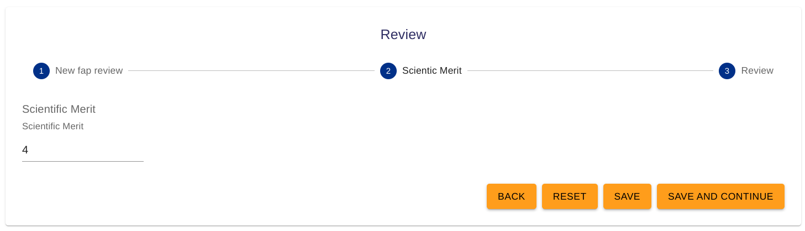

# FAP review templates :material-note-text:

---

## What are FAP review templates?

FAP review templates :material-note-text: are designed to capture all necessary information that reviewers need to provide when submitting their FAP reviews. These templates generally include questions regarding scientific evaluation of the associated proposal. Users fill in their answers to these questions in the predefined fields and submit their reviews.

User Officers can also utilize [questions :material-comment-question:](../questions.md) and [sub-templates :material-collapse-all-outline:](../templates/sub_template.md) to customize review templates to include specific questions based on the nature and requirements of the research.

<figure markdown="span">  
    { width="450"}
    <figcaption>FAP review (viewed from the reviewer's perspective)</figcaption>
</figure>

---

## How do I link FAP review templates to a call?

- See the [creating a call](../creating_call.md) guide.

---

## How do I create a FAP review template?

**Step 1: Adding topics**

- In the **main menu** :material-menu: select **Templates** :material-text-box-multiple:
- From the dropdown menu, choose **FAP Review** :material-note-text:
- From the template page, use the `Create` button.
- Enter a name and optional description for your new template.

- This will bring you to the template editor. From here you may add topics which act as the different sections within the questionnaire that users fill out.

> **_NOTE:_** It is good practice to utilize topics to split up the presentation of information for users. For example, in a FAP review template you may wish to have a topic for addressing general comments, another for scientific merit and another for the final grade, etc.

You can add questions to topics by clicking on **options** and from the dropdown select **^^`Add topic`^^**. Topics can be reordered by clicking on the **^^`Reorder topics mode`^^** option. In reorder topics mode, you may drag and drop the topics into the desired order.

**Step 2: Adding questions**

- To add [questions :material-comment-question:](../questions.md) click on **options** and from the dropdown select **^^`Add question`^^**.
- This will open the **question drawer** which contains all previously used questions. You can **^^`Search`^^**:material-magnify: for pre-existing questions through **question text** or by **question type**. You may preview questions in the question drawer by clicking on them.

Not all question types are compatible with every template. For example, **sub-template** questions can only be added to **proposal templates**.

- There are several different options when adding questions to a template:

**1. Use a pre-existing question**

- To add a pre-exisiting question to the template simply find it in the question drawer and drag and drop it into the template.

**2. Edit a pre-existing question**

- First add a pre-exisiting question to the template. You can them modify it by clicking on it within the template.

> **_NOTE:_** The changes you make to questions will only be updated within the current template you are creating. If you wish to make changes to the question **across all templates** click on the `edit` (question key) link at the top of the question.

Once you are satisfied with your changes, click the `Update` button to save the changes to the question within the current template.

**3. Creating a question**

- You may also create questions from scratch by clicking on **options** within the **question drawer** and selecting the question type you wish to create.

---

## How do I edit FAP review templates?

**Step 1: Navigate to the FAP review templates page**

- To edit a pre-existing FAP review template, select **Templates** :material-text-box-multiple: from the **main menu** :material-menu:
- From the dropdown menu, choose **FAP review** :material-note-text:

**Step 2: Find the FAP review template you wish to edit**

- On the FAP review templates page, find the template you wish to edit. You may wish to use the **^^`Search`^^**:material-magnify: function to search for the name or description if there are a lot of templates.

**Step 3: Edit the template**

- Click the **^^`Edit`^^** action on the template you wish to make changes to. In the FAP review template editor you can make the desired changes to the FAP review template. See the [creating FAP review templates](fap_review_template.md) guide for more information on the FAP review template editor and using [questions :material-comment-question:](../questions.md)

---

## How do I clone FAP review templates?

**Step 1: Navigate to the FAP review templates page**

- To clone a pre-existing FAP review template, select **Templates** :material-text-box-multiple: from the **main menu** :material-menu:
- From the dropdown menu, choose **FAP Review**

**Step 2: Find the FAP review template you wish to edit**

- On the FAP review templates page, find the template you wish to clone. You may wish to use the `SEARCH` function to search for the name or description if there are a lot of templates.

**Step 3: Clone the template**

- Click the `CLONE` action on the template to create a clone. Note: the clone will be renamed 'Copy of (name)' and will be added to the end of the list of FAP review templates.

---

## How do I archive and unarchive FAP review templates?

The archive system allows you to save FAP review templates for future reference. Archiving FAP review templates will prevent them from being able to be linked to calls or searched for in the FAP review templates page.

> **_NOTE:_** This feature is useful to prevent infrequently used FAP review templates from crowding the User Office interface.

**Step 1: Navigate to the FAP review templates page**

- To archive or unarchive FAP review templates, select **Templates** :material-text-box-multiple: from the **main menu** :material-menu:
- From the dropdown menu, choose **FAP review template** :material-note-text:

**Step 2: Archive or Unarchive a FAP review template**

- To **archive** a FAP review template, click on the `ARCHIVE` action next to the template name. This action will send the FAP review template to the `ARCHIVED` tab.
- To **unarchive** a FAP review template, simply go to the `ARCHIVED` tab and click on the `UNARCHIVE` action next to the template name. This action will send the FAP review template to the `CURRENT` tab.

---

## How do I import and export FAP review templates?

**Step 1: Navigate to the FAP review templates page**

- To import or export a **FAP review template** :material-note-text:, select **Templates** :material-text-box-multiple: from the **main menu** :material-menu:
- From the dropdown menu, choose **FAP Review template** :material-note-text:

**Step 2: Import or Export a FAP review template**

- To **Import** a FAP review template, click on the **^^`IMPORT`^^** button at the bottom of the page. This will open the Import template page. From here, click on **^^`SELECT FILE`^^** to import .json FAP review templates.

- To **Export** a FAP review template, click on the **^^`Export`^^** :material-share-variant: action on the desired template. This action will export the FAP review template to a .json file which can be shared and imported in User Office.

---

## What does #review mean on FAP review templates?

- '#review' refers to the number of reviews the FAP review template has been utilized in.

---

## What does #calls mean on FAP review templates?

- '#calls' refers to the number of calls the FAP review template has been utilized in.

---
