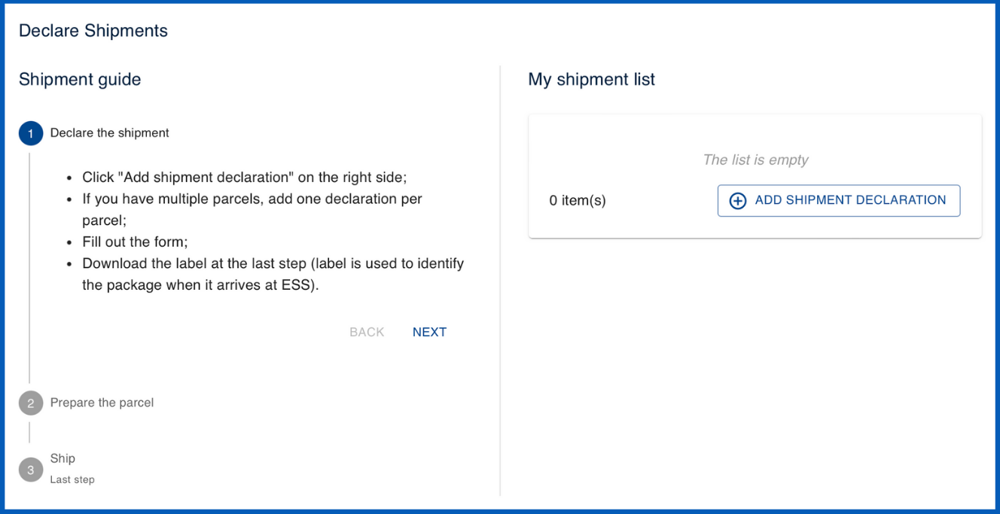

# Shipment declaration templates :material-truck:

_____________________________________________________________________________________________________

## What are shipment declaration templates?

Shipment declaration templates :material-truck: are standardized forms used to collect and organize information about parcels being sent to a facility. These templates can be customized to guide users through the process of declaring each shipment, generating labels for package identification, and ensuring compliance with shipping protocols. Each parcel's details, including tracking information and handling instructions, are documented to facilitate smooth and traceable delivery to the facility.

> **_NOTE:_** The shipment declaration form will only become accessible for users to fill out after their proposal status has been set to 'accepted' and the experiment has been allocated a time within the scheduler.

<figure markdown="span">  
        { width="450"}
        <figcaption>Shipment declaration (viewed from the user's perspective)</figcaption>
    </figure>

_____________________________________________________________________________________________________
