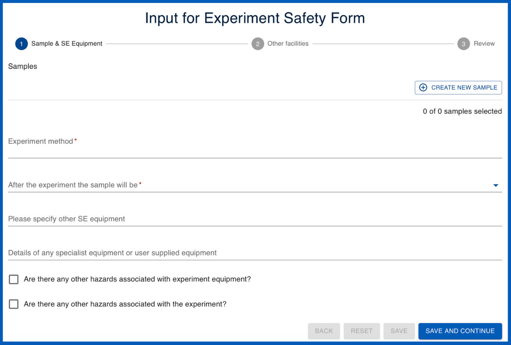

# Templates

Templates are used to save and re-utilise predefined information across User Office. Calls are built using several different types of templates which can be edited and cloned. Templates carry information and serve many functions; for example, they may contain specific questions to be used within the call which users answer in their proposals. The template system is useful because it saves you having to do all the work from scratch every time. Furthermore, it allows for standardisation which is essential for data collection and analysis.

There are several different types of templates utilised within Calls:

??? info "Proposal templates" 

    [**Proposal templates**](proposal_template.md) are designed to capture all necessary information that users need to provide when submitting their proposals. For example, these templates generally include questions regarding experiment details, objectives, safety considerations and required resources. Users fill in their answers to these questions in the predefined fields and submit their proposals for review.

    User Officers can also utilise [**question templates**](question_template.md) and [**sub-templates**](sub_template.md) to customise proposal templates to include specific questions based on the nature and requirements of the research.

    ______________________________________________________________________________________
    <figure markdown="span">  
        { width="450"}
        <figcaption>**Proposal (viewed from the user's perspective)**</figcaption>
    </figure>

??? info "Proposal ESI templates" 

    [**Proposal Experimental Safety Input (ESI)**](proposalESI_template.md) are designed to collect and document safety-related information for research proposals, ensuring that all necessary safety considerations are addressed before the experiment begins. User Officers can use ESI templates to gather details about potential hazards, risk assessments, safety measures, and compliance with regulatory standards. This structured approach helps in maintaining a safe research environment and ensures that all safety protocols are thoroughly evaluated and documented. User Officers can also utilise [**question templates**](question_template.md) and [**sub-templates**](sub_template.md) to customise Proposal ESI templates.

    ______________________________________________________________________________________
    
    <figure markdown="span">  
        { width="450"}
        <figcaption>**Proposal ESI (viewed from the user's perspective)**</figcaption>
    </figure>

??? info "PDF templates" 

    [**PDF templates**](pdf_template.md) enable users and User Officers to download proposals in a well-formatted and standardised PDF document for summary and sharing. User Officers can customise PDF templates by adjusting code to modify elements such as font size, colour and other formatting options.

    ______________________________________________________________________________________

    <figure markdown="span">  
        { width="450"}
        <figcaption>**PDF template**</figcaption>
    </figure>
    

??? info "Shipment declaration templates" 

    [**Shipment declaration templates**](shipment_template.md) allow users to fill out a questionnaire to declare shipments.
    ______________________________________________________________________________________
    
    <figure markdown="span">  
        { width="450"}
        <figcaption>**Shipment declaration (viewed from the user's perspective)**</figcaption>
    </figure>

??? info "Visit registration templates" 

    [**Visit registration templates**](visit_template.md) allow users to fill out a questionnaire to provide information about their visit registration.
    ______________________________________________________________________________________
    
    <figure markdown="span">  
        { width="450"}
        <figcaption>**Visit reigstration (viewed from the user's perspective)**</figcaption>
    </figure>

??? info "Feedback templates" 

    [**Feedback templates**](feedback_template.md) allow users to provide feedback about their experiment and experience at the facility through a questionnaire.
    ______________________________________________________________________________________
    
    <figure markdown="span">  
        { width="450"}
        <figcaption>**Feedback form (viewed from the user's perspective)**</figcaption>
    </figure>

* [How do I use templates within a call?](../creating_call.md)

______________________________________________________________________________________

