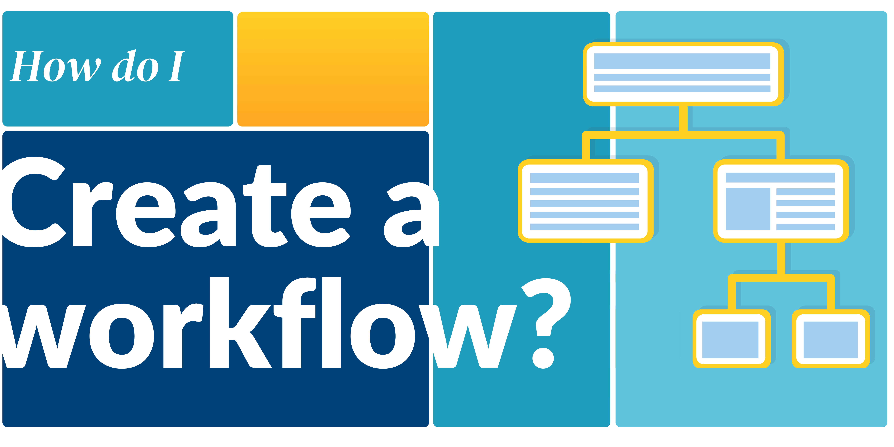
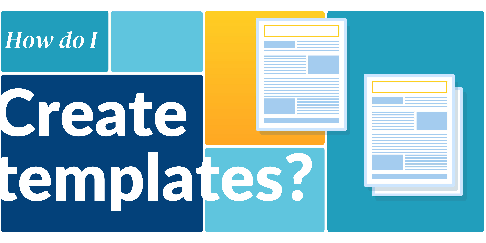

# Welcome to the User Officer guide!

_________________________________________________________________________________________________________

There are three fundamental tutorials in this guide:

{ width="400" align=right } 
!!! info inline end ""
    [Create a call :material-calendar-blank:](creating_call.md){ .md-button .md-button--primary }
    
    Calls allow users’ proposals to be submitted and managed within User Office. A call is a period of time during which users can submit proposals to a facility. 

{ width="400" align=right } 
!!! info inline end ""
    [Create a workflow :material-sitemap:](settings/proposal_workflow.md){ .md-button .md-button--primary }

    Proposal workflows manages how proposals are processed, with User Officers defining the statuses and events that guide proposals through their lifecycle.
    
{ width="400" align=right } 
!!! info inline end ""
    [Create templates :material-text-box-multiple:](creating_templates.md){ .md-button .md-button--primary }

    Templates are used to save and reuse predefined information across User Office. Calls are built using several different types of templates.
